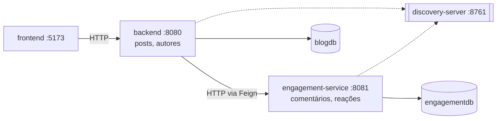

# blog (kissaten)

blog em Spring Boot com front-end em React. autores escrevem posts, posts viram de rascunho para publicado, e leitores comentam e reagem.

o projeto começou como um monólito organizado em camadas e bounded contexts (primeira entrega), evoluiu para uma camada de persistência mais completa, com histórico de mudanças dos dados e testes automatizados (segunda entrega), e agora se partiu: o contexto de engajamento saiu do monólito e virou um **microsserviço** com processo, banco e deploy próprios, com os dois serviços conversando por rede através de Spring Cloud (terceira entrega).

a explicação completa da arquitetura, com os diagramas de componentes e de sequência, está em [docs/ARQUITETURA.md](docs/ARQUITETURA.md); os detalhes da camada de persistência e do histórico estão em [docs/PERSISTENCIA.md](docs/PERSISTENCIA.md); e o microsserviço, a integração distribuída e os endpoints novos estão em [docs/MICROSSERVICO.md](docs/MICROSSERVICO.md).

## stack

- Java 21 e Spring Boot 3.3 (web, data jpa, validation)
- Spring Cloud 2023.0.3: Eureka (descoberta), OpenFeign (chamada declarativa), LoadBalancer, Resilience4j (circuit breaker)
- H2 em memória, um banco por serviço (zera a cada restart, sem precisar instalar banco)
- Hibernate Envers e Spring Data Envers para o histórico de dados
- React 18 com Vite
- Maven (via wrapper, não precisa instalar)

## estrutura

o sistema são três processos de back-end e um front-end. cada serviço é um projeto Maven independente, com o seu próprio wrapper — é o que significa poder ser implantado sozinho.

```
.
├── discovery-server     registro de serviços (Eureka)          :8761
├── backend              o monólito: posts e autores            :8080
├── engagement-service   o microsserviço: comentários e reações  :8081
├── frontend             a interface (React + Vite)             :5173
└── docs                 documentação de arquitetura
```



o navegador fala **apenas** com o monólito; o engajamento é alcançado por dentro, servidor a servidor. os dois bancos são separados de verdade: não há junção nem chave estrangeira entre `posts` e `comments`.

## como rodar

precisa de um JDK 21 e do Node 18+ instalados. o Maven vem junto pelo wrapper.

são quatro terminais, e **a ordem importa** — suba a descoberta primeiro, para que os dois serviços encontrem o registro já no startup.

### 1. servidor de descoberta

```bash
cd discovery-server
./mvnw spring-boot:run
```

o painel do Eureka fica em `http://localhost:8761`. é onde se vê quais serviços estão registrados.

### 2. microsserviço de engajamento

```bash
cd engagement-service
./mvnw spring-boot:run
```

sobe em `http://localhost:8081` e semeia alguns comentários e reações de exemplo. o console do banco fica em `http://localhost:8081/h2-console` (JDBC URL `jdbc:h2:mem:engagementdb`, usuário `sa`, sem senha).

### 3. monólito

```bash
cd backend
./mvnw spring-boot:run
```

a API sobe em `http://localhost:8080` e popula o H2 com alguns autores e posts de exemplo. o console do banco fica em `http://localhost:8080/h2-console` (JDBC URL `jdbc:h2:mem:blogdb`).

logo depois de subir, o monólito pode levar até 10 segundos para ver o engajamento no registro — nesse intervalo, comentários e reações respondem 503, o que é o comportamento correto. para confirmar que os dois se encontraram:

```bash
curl localhost:8080/api/engagement/status
# {"service":"engagement-service","available":true,"registeredInstances":1,...}
```

### 4. front-end

```bash
cd frontend
npm install
npm run dev
```

a interface abre em `http://localhost:5173`. suba os serviços antes, senão as telas aparecem com erro de conexão.

### rodando sem o servidor de descoberta

se quiser subir só dois processos, é possível apontar o monólito direto para o microsserviço, sem Eureka:

```bash
cd backend
./mvnw spring-boot:run -Dspring-boot.run.arguments=--engagement.service.url=http://localhost:8081
```

é uma saída de emergência, útil para uma verificação rápida, e não o modo de operação: com endereço fixo você perde a descoberta e o balanceamento entre instâncias, que são justamente o que o Spring Cloud está resolvendo.

## api

tudo fica sob o prefixo `/api`. as tabelas abaixo são a API do **monólito**, que é a que o front consome. o microsserviço tem a API própria dele, documentada em [docs/MICROSSERVICO.md](docs/MICROSSERVICO.md).

### autores

| método | rota                        | o que faz                      |
| ------ | --------------------------- | ------------------------------ |
| GET    | `/api/authors`              | lista os autores               |
| GET    | `/api/authors/{id}`         | busca um autor                 |
| GET    | `/api/authors/{id}/history` | histórico de mudanças do autor |
| POST   | `/api/authors`              | cadastra um autor              |
| PUT    | `/api/authors/{id}`         | atualiza nome e bio            |
| DELETE | `/api/authors/{id}`         | remove um autor                |

### posts

| método | rota                      | o que faz                               |
| ------ | ------------------------- | --------------------------------------- |
| GET    | `/api/posts`              | lista os posts (mais recentes primeiro) |
| GET    | `/api/posts/{id}`         | busca um post                           |
| GET    | `/api/posts/{id}/history` | histórico de revisões do post           |
| POST   | `/api/posts`              | cria um post (nasce como rascunho)      |
| PUT    | `/api/posts/{id}`         | edita título e texto                    |
| POST   | `/api/posts/{id}/publish` | publica um rascunho                     |
| DELETE | `/api/posts/{id}`         | remove um post (e limpa o engajamento dele) |

### comentários

servidos pelo microsserviço, através do monólito. as rotas são **as mesmas de antes da migração**: o front não mudou uma linha por causa dela.

| método | rota                           | o que faz                       |
| ------ | ------------------------------ | ------------------------------- |
| GET    | `/api/posts/{postId}/comments` | lista os comentários de um post |
| POST   | `/api/posts/{postId}/comments` | adiciona um comentário          |
| DELETE | `/api/comments/{commentId}`    | remove um comentário            |

### reações (novo)

| método | rota                                                  | o que faz                                    |
| ------ | ----------------------------------------------------- | -------------------------------------------- |
| GET    | `/api/posts/{postId}/reactions?reader={nome}`         | resumo: total, contagem por tipo e as do leitor |
| POST   | `/api/posts/{postId}/reactions`                       | registra uma reação                          |
| DELETE | `/api/posts/{postId}/reactions/{type}?reader={nome}`  | desfaz uma reação                            |

os tipos são `CORACAO`, `CAFE` e `IDEIA`, e o vocabulário pertence ao microsserviço — o monólito só repassa. o `reader` identifica quem está reagindo (não há login; o nome fica guardado no navegador) e é opcional na consulta: sem ele, a resposta traz os totais sem marcar nada.

### diagnóstico da integração (novo)

| método | rota                      | o que faz                                              |
| ------ | ------------------------- | ------------------------------------------------------ |
| GET    | `/api/engagement/status`  | se o engajamento está disponível e quantas instâncias estão registradas |

responde sempre 200, inclusive quando o microsserviço está fora do ar — a informação "ele caiu" vem no corpo. é o que alimenta o selo no cabeçalho da interface.

### exemplo

```bash
# criar um autor
curl -X POST http://localhost:8080/api/authors \
  -H 'Content-Type: application/json' \
  -d '{"name":"Ana Souza","email":"ana@blog.dev","bio":"escreve sobre arquitetura"}'

# criar um post para esse autor (supondo id 1)
curl -X POST http://localhost:8080/api/posts \
  -H 'Content-Type: application/json' \
  -d '{"title":"Olá mundo","content":"primeiro post","authorId":1}'

# publicar o post
curl -X POST http://localhost:8080/api/posts/1/publish

# comentar (grava no banco do microsserviço)
curl -X POST http://localhost:8080/api/posts/1/comments \
  -H 'Content-Type: application/json' \
  -d '{"authorName":"Carla","content":"ótimo texto"}'

# reagir
curl -X POST http://localhost:8080/api/posts/1/reactions \
  -H 'Content-Type: application/json' \
  -d '{"readerName":"Victor","type":"IDEIA"}'

# ver o resumo de reações do ponto de vista de um leitor
curl 'http://localhost:8080/api/posts/1/reactions?reader=Victor'

# ver o histórico de revisões desse post
curl http://localhost:8080/api/posts/1/history
```

## o microsserviço

o contexto de engajamento saiu do monólito porque o desenho já apontava para ele: não compartilhava entidade nenhuma com o resto do sistema, dependia do outro lado apenas por uma interface que ele mesmo declarava (a `PostCatalog`), e tem um ciclo de vida de negócio próprio. onde o acoplamento é assim, mover de processo é cirurgia pequena.

além de mudar de endereço, o engajamento ganhou uma capacidade nova, as **reações** — porque mover código existente prova que a fronteira estava no lugar certo, mas só desenvolver algo novo do outro lado prova que o serviço é autônomo de verdade. a regra de "uma reação de cada tipo por leitor", os tipos que existem e a contagem vivem inteiramente no microsserviço.

o que a distribuição obrigou a resolver, e que não existia antes:

- **encontrar o outro serviço** sem endereço fixo no código — Eureka e o `@FeignClient` pelo nome lógico
- **falhar bem** quando ele não responde — circuit breaker com Resilience4j, e 503 em vez de 500 ou de uma lista vazia mentindo que o post não tem conversa
- **preservar o significado do erro** na travessia — 404 continua 404 e 409 continua 409, com a mensagem escrita pelo serviço dono da regra
- **manter os dois bancos coerentes** sem chave estrangeira — apagar um post publica um evento de domínio que dispara a limpeza do engajamento no outro serviço
- **degradar com clareza na interface** — com o engajamento fora do ar, o post continua legível, a conversa avisa o que aconteceu e o formulário de comentário sai da tela

o passo a passo de tudo isso, com os diagramas, os formatos e o que ficou de fora (API Gateway, Config Server, mensageria, tracing), está em [docs/MICROSSERVICO.md](docs/MICROSSERVICO.md).

## histórico de dados

toda mudança em um autor, post ou comentário é registrada automaticamente pelo Hibernate Envers em tabelas de auditoria (`posts_AUD` e `authors_AUD` no banco do monólito, `comments_AUD` no do microsserviço, além da `REVINFO` que numera as revisões em cada um). não é preciso fazer nada no fluxo de escrita: criar, editar, publicar ou apagar já grava uma revisão com o estado daquele momento.

a consulta sai pelos endpoints de histórico. cada entrada traz os metadados da revisão (número, tipo — `INSERT`, `UPDATE` ou `DELETE` — e instante) junto do estado do registro naquele ponto. um post apagado continua tendo histórico, inclusive a revisão da exclusão com o último estado conhecido. na interface, a página de um post tem um botão que abre essa linha do tempo. os detalhes de como isso funciona por dentro estão em [docs/PERSISTENCIA.md](docs/PERSISTENCIA.md).

as reações não são auditadas: auditar cada clique encheria a tabela de histórico com ruído sem responder a nenhuma pergunta que alguém realmente faça.

## testes

são 89 testes automatizados, e cada serviço roda os seus a partir do próprio diretório com `./mvnw test`.

| onde                | quantos | o que cobre                                                        |
| ------------------- | ------- | ------------------------------------------------------------------ |
| `backend`           | 51      | persistência, histórico, tratamento de erro e a fronteira de rede   |
| `engagement-service`| 37      | repositórios, regras de reação, API e a auditoria do comentário     |
| `discovery-server`  | 1       | o registro sobe e responde                                          |

na camada de persistência há testes de repositório com `@DataJpaTest` (consultas derivadas, agregação por tipo, restrições de unicidade, valores padrão e travamento otimista) e testes de histórico com `@SpringBootTest` que exercitam o Envers de ponta a ponta — o ciclo de vida completo de um post e o endpoint de consulta.

na integração distribuída, os testes de API do monólito trocam o cliente do microsserviço por um dublê, o que permite cobrir justamente os caminhos difíceis de provocar de outra forma: o 503 quando o engajamento cai, o 404 que atravessa a fronteira sem virar erro de infraestrutura, e a verificação de que o post é validado **antes** de qualquer chamada de rede. o `EngagementErrorDecoder` e o fallback têm testes de unidade próprios.

o que os testes automatizados não cobrem é a conversa real entre os três processos — isso foi verificado à mão, e o roteiro da demonstração está em [docs/MICROSSERVICO.md](docs/MICROSSERVICO.md).

## erros

a API responde erro sempre no mesmo formato, com `timestamp`, `status`, `message` e o caminho. os dois serviços usam o mesmo envelope, o que permite ao monólito repassar a mensagem original de quem recusou a requisição. os principais casos:

- 400 quando o corpo não passa na validação (traz a lista de campos com problema) ou quando o microsserviço recusa o valor enviado
- 404 quando o recurso não existe, de qualquer um dos dois lados
- 409 quando uma regra é violada (email de autor repetido, reação repetida do mesmo leitor) ou quando há conflito de concorrência/integridade na gravação
- 503 quando o microsserviço de engajamento não responde — a requisição estava correta, o sistema é que está com uma peça faltando
