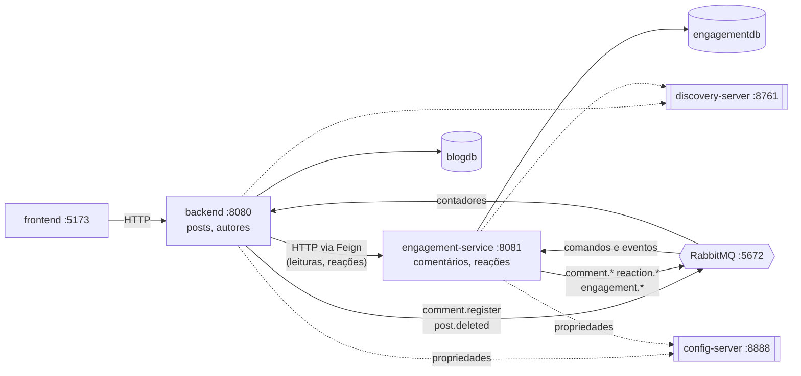

# blog (kissaten)

[](https://github.com/vctorgriggi/Projeto-Bloco-Teste-Performance-02/actions/workflows/pipeline.yml)

blog em Spring Boot com front-end em React. autores escrevem posts, posts viram de rascunho para publicado, e leitores comentam e reagem.

o projeto começou como um monólito organizado em camadas e bounded contexts (primeira entrega), evoluiu para uma camada de persistência mais completa, com histórico de mudanças dos dados e testes automatizados (segunda entrega), e se partiu: o contexto de engajamento saiu do monólito e virou um **microsserviço** com processo, banco e deploy próprios, com os dois serviços conversando por rede através de Spring Cloud (terceira entrega). agora a conversa entre eles ficou **orientada a eventos**: onde quem chama não precisa da resposta para seguir, a chamada HTTP deu lugar a mensagens no **RabbitMQ** — o comentário virou um comando em fila, o post apagado virou um evento publicado por outbox, e a estante ganhou contadores alimentados pelos eventos do engajamento (quarta entrega). por fim, o sistema foi preparado para **operar em produção**: cada serviço virou uma imagem Docker, a stack roda num cluster **Kubernetes** com PostgreSQL, rollout sem queda e autoescalonamento, a operação é observável com **OpenTelemetry e Grafana** (logs, traces que atravessam a fila, métricas), e um pipeline no **GitHub Actions** testa, implanta num Kubernetes efêmero e publica cada versão (quinta entrega).

a explicação completa da arquitetura, com os diagramas de componentes e de sequência, está em [docs/ARQUITETURA.md](docs/ARQUITETURA.md); os detalhes da camada de persistência e do histórico estão em [docs/PERSISTENCIA.md](docs/PERSISTENCIA.md); o microsserviço e a integração por HTTP estão em [docs/MICROSSERVICO.md](docs/MICROSSERVICO.md); a arquitetura orientada a eventos — prós e contras, topologia, padrões de mensagem, fluxos e o roteiro de demonstração — está em [docs/EVENTOS.md](docs/EVENTOS.md); e a implantação — contêineres, Kubernetes, monitoramento, CI/CD, testes e o roteiro de operação — está em [docs/IMPLANTACAO.md](docs/IMPLANTACAO.md). o que mudou em cada versão está no [CHANGELOG.md](CHANGELOG.md).

## stack

- Java 21 e Spring Boot 3.3 (web, data jpa, validation)
- Spring Cloud 2023.0.3: Config (configuração central), Eureka (descoberta), OpenFeign (chamada declarativa), LoadBalancer, Resilience4j (circuit breaker)
- RabbitMQ 3.13 com Spring AMQP (`spring-boot-starter-amqp`): exchanges, filas duráveis, dead letter, publisher confirms
- Docker (imagens de cada serviço, compose), Kubernetes com kustomize (kind no ambiente local e no pipeline)
- OpenTelemetry (agente Java) e Grafana LGTM: Loki, Tempo, Prometheus e Grafana
- GitHub Actions (CI/CD) e GitHub Container Registry; k6 para carga; Vitest no front
- H2 em memória no desenvolvimento, um banco por serviço (zera a cada restart, sem precisar instalar banco); PostgreSQL 16 com migrações Flyway em contêiner
- Hibernate Envers e Spring Data Envers para o histórico de dados
- React 18 com Vite
- Maven (via wrapper, não precisa instalar)

## estrutura

o sistema são quatro processos de back-end, um broker de mensagens e um front-end. cada serviço é um projeto Maven independente, com o seu próprio wrapper — é o que significa poder ser implantado sozinho.

```
.
├── config-server        configuração central (Spring Cloud Config)  :8888
├── discovery-server     registro de serviços (Eureka)               :8761
├── backend              o monólito: posts e autores                 :8080
├── engagement-service   o microsserviço: comentários e reações       :8081
├── frontend             a interface (React + Vite)                  :5173
├── deploy               kubernetes (kustomize), kind, postgres, coletor e dashboards
├── scripts              e2e, carga (k6), subir e derrubar o cluster kubernetes
├── .github              pipeline de ci/cd, dependabot, template de pr
├── docs                 documentação de arquitetura
├── docker-compose.yml   o broker, ou a stack inteira (--profile completo)
├── subir.sh             sobe tudo na ordem certa (desenvolvimento)
└── derrubar.sh          encerra tudo
```

os dois primeiros são infraestrutura: não têm domínio nem banco, e existem para resolver o que só aparece com mais de um processo — *onde está o outro serviço?* e *de onde vêm as propriedades dele?*



o navegador fala **apenas** com o monólito; o engajamento é alcançado por dentro, servidor a servidor — por HTTP quando o monólito precisa da resposta na hora, e pelo broker quando não precisa. os dois bancos são separados de verdade: não há junção nem chave estrangeira entre `posts` e `comments`.

## como rodar

são três jeitos, do mais leve ao mais próximo de produção:

| como | o que sobe | para quê |
| --- | --- | --- |
| `./subir.sh` | os serviços pelo `./mvnw`, H2 em memória, RabbitMQ em contêiner | desenvolvimento |
| `docker compose --profile completo up -d --build --wait` | tudo em contêiner: PostgreSQL, RabbitMQ, observabilidade, duas réplicas do engajamento | ambiente simulado de produção |
| `scripts/k8s-subir.sh` | tudo num cluster Kubernetes local (kind), com HPA e rollout sem queda | ambiente simulado de produção orquestrado |

nos dois últimos, a interface fica em `http://localhost:8080` (compose) ou `http://localhost:30080` (Kubernetes), e o Grafana em `http://localhost:3000` ou `http://localhost:30300` (admin / admin). o teste de ponta a ponta roda contra qualquer um dos três:

```bash
scripts/e2e.sh http://localhost:8080                                  # compose
GRAFANA_URL=http://localhost:30300 scripts/e2e.sh http://localhost:30080   # kubernetes, conferindo traces e logs
```

o detalhe dos dois modos de produção — e o roteiro de demonstração da operação — está em [docs/IMPLANTACAO.md](docs/IMPLANTACAO.md). o resto desta seção é o modo de desenvolvimento.

precisa de um JDK 21, do Node 18+ e do Docker instalados (e, para o Kubernetes, do `kind` e do `kubectl`). o Maven vem junto pelo wrapper.

### tudo de uma vez

```bash
./subir.sh              # sobe o broker, os quatro serviços e o front-end
./subir.sh --sem-front  # o broker e os serviços
./derrubar.sh           # encerra tudo (o broker para, as filas ficam guardadas)
./derrubar.sh --limpar  # idem, e apaga as filas e mensagens do broker
```

o script sobe o RabbitMQ por `docker compose`, sobe os serviços na ordem certa, espera cada peça responder antes de seguir, instala as dependências do front se faltarem e avisa quando o monólito e o microsserviço se encontraram. os logs de cada processo ficam em `.logs/`. se um serviço morrer no startup, ele mostra o fim do log na hora, em vez de esperar o timeout.

### ou, um terminal por serviço

**a ordem importa**: o config server serve as propriedades dos serviços de negócio, e o registro precisa existir para eles se encontrarem. subir fora de ordem funciona — o cliente de configuração tem retry, e o monólito responde 503 enquanto não vê o engajamento — mas demora e polui o log.

### 0. broker de mensagens

```bash
docker compose up -d rabbitmq
```

sobe o RabbitMQ em `localhost:5672`, com o painel em `http://localhost:15672` (usuário e senha `guest`). ele sobe vazio: exchanges e filas são criados pelos próprios serviços quando conectam. é o painel onde se vê as mensagens esperando nas filas e as que foram para a dead letter.

sem o broker, os serviços sobem e o blog funciona, com duas exceções: enviar um comentário responde 503 (o texto continua no formulário), e os contadores da estante não se atualizam. os eventos de post apagado ficam guardados no banco do monólito e saem quando o broker aparecer.

### 1. servidor de configuração

```bash
cd config-server
./mvnw spring-boot:run
```

sobe em `http://localhost:8888`. para ver o que ele entrega a cada serviço:

```bash
curl localhost:8888/blog-api/default
curl localhost:8888/engagement-service/default
```

as propriedades ficam em [config-server/src/main/resources/config/](config-server/src/main/resources/config/): `application.yml` vale para todos os clientes, e `blog-api.yml` / `engagement-service.yml` para cada um.

### 2. servidor de descoberta

```bash
cd discovery-server
./mvnw spring-boot:run
```

o painel do Eureka fica em `http://localhost:8761`. é onde se vê quais serviços estão registrados.

### 3. microsserviço de engajamento

```bash
cd engagement-service
./mvnw spring-boot:run
```

sobe em `http://localhost:8081` e semeia alguns comentários e reações de exemplo. o console do banco fica em `http://localhost:8081/h2-console` (JDBC URL `jdbc:h2:mem:engagementdb`, usuário `sa`, sem senha).

### 4. monólito

```bash
cd backend
./mvnw spring-boot:run
```

a API sobe em `http://localhost:8080` e popula o H2 com alguns autores e posts de exemplo. o console do banco fica em `http://localhost:8080/h2-console` (JDBC URL `jdbc:h2:mem:blogdb`).

logo depois de subir, o monólito pode levar até 10 segundos para ver o engajamento no registro — nesse intervalo, comentários e reações respondem 503, o que é o comportamento correto. para confirmar que os dois se encontraram:

```bash
curl localhost:8080/api/engagement/status
# {"service":"engagement-service","available":true,"registeredInstances":1,...}
```

### 5. front-end

```bash
cd frontend
npm install
npm run dev
```

a interface abre em `http://localhost:5173`. suba os serviços antes, senão as telas aparecem com erro de conexão.

### rodando sem o servidor de descoberta

é possível apontar o monólito direto para o microsserviço, sem Eureka:

```bash
cd backend
./mvnw spring-boot:run -Dspring-boot.run.arguments=--engagement.service.url=http://localhost:8081
```

é uma saída de emergência, útil para uma verificação rápida, e não o modo de operação: com endereço fixo você perde a descoberta e o balanceamento entre instâncias, que são justamente o que o Spring Cloud está resolvendo.

o config server, por outro lado, **não** é opcional para os serviços de negócio: eles esperam por ele no startup (com retry) em vez de subir com metade das propriedades que esperavam. isso é deliberado, e a justificativa está em [docs/MICROSSERVICO.md](docs/MICROSSERVICO.md). se precisar apontar para outro endereço, use `CONFIG_SERVER_URL`.

## api

tudo fica sob o prefixo `/api`. as tabelas abaixo são a API do **monólito**, que é a que o front consome. o microsserviço tem a API própria dele, documentada em [docs/MICROSSERVICO.md](docs/MICROSSERVICO.md).

### autores

| método | rota                        | o que faz                      |
| ------ | --------------------------- | ------------------------------ |
| GET    | `/api/authors`              | lista os autores               |
| GET    | `/api/authors/{id}`         | busca um autor                 |
| GET    | `/api/authors/{id}/history` | histórico de mudanças do autor |
| POST   | `/api/authors`              | cadastra um autor              |
| PUT    | `/api/authors/{id}`         | atualiza nome e bio            |
| DELETE | `/api/authors/{id}`         | remove um autor                |

### posts

| método | rota                      | o que faz                               |
| ------ | ------------------------- | --------------------------------------- |
| GET    | `/api/posts`              | lista os posts (mais recentes primeiro) |
| GET    | `/api/posts/{id}`         | busca um post                           |
| GET    | `/api/posts/{id}/history` | histórico de revisões do post           |
| POST   | `/api/posts`              | cria um post (nasce como rascunho)      |
| PUT    | `/api/posts/{id}`         | edita título e texto                    |
| POST   | `/api/posts/{id}/publish` | publica um rascunho                     |
| DELETE | `/api/posts/{id}`         | remove um post (e limpa o engajamento dele) |

### comentários

servidos pelo microsserviço, através do monólito. as rotas são **as mesmas de antes da migração**.

desde a quarta entrega, o `POST` responde **202 Accepted**, e não mais 201: o comentário vira um comando na fila do engajamento e é gravado logo em seguida — ou quando o engajamento voltar, se ele estiver fora do ar. a resposta traz o `submissionId`, e o comentário aparece na listagem com esse mesmo id. o 503 nessa rota passou a significar que o **broker** está fora, e não o microsserviço.

| método | rota                           | o que faz                       |
| ------ | ------------------------------ | ------------------------------- |
| GET    | `/api/posts/{postId}/comments` | lista os comentários de um post |
| POST   | `/api/posts/{postId}/comments` | envia um comentário (202, entra na fila) |
| DELETE | `/api/comments/{commentId}`    | remove um comentário            |

### reações (novo)

| método | rota                                                  | o que faz                                    |
| ------ | ----------------------------------------------------- | -------------------------------------------- |
| GET    | `/api/posts/{postId}/reactions?reader={nome}`         | resumo: total, contagem por tipo e as do leitor |
| POST   | `/api/posts/{postId}/reactions`                       | registra uma reação                          |
| DELETE | `/api/posts/{postId}/reactions/{type}?reader={nome}`  | desfaz uma reação                            |

os tipos são `CORACAO`, `CAFE` e `IDEIA`, e o vocabulário pertence ao microsserviço — o monólito só repassa. o `reader` identifica quem está reagindo (não há login; o nome fica guardado no navegador) e é opcional na consulta: sem ele, a resposta traz os totais sem marcar nada.

### diagnóstico da integração (novo)

| método | rota                      | o que faz                                              |
| ------ | ------------------------- | ------------------------------------------------------ |
| GET    | `/api/engagement/status`  | se o engajamento e o broker estão disponíveis, quantas instâncias estão registradas e quantos eventos esperam no outbox |

responde sempre 200, inclusive quando o microsserviço está fora do ar — a informação "ele caiu" vem no corpo. é o que alimenta os selos no cabeçalho da interface.

### contadores de engajamento (novo)

| método | rota                        | o que faz                                                   |
| ------ | --------------------------- | ----------------------------------------------------------- |
| GET    | `/api/engagement/counters`  | total de comentários e reações de cada post, numa chamada só |

sai de uma cópia local que o monólito mantém a partir dos eventos do engajamento, e não de uma chamada ao microsserviço: responde mesmo com ele fora do ar. o `updatedAt` de cada linha diz de quando é a informação.

### exemplo

```bash
# criar um autor
curl -X POST http://localhost:8080/api/authors \
  -H 'Content-Type: application/json' \
  -d '{"name":"Ana Souza","email":"ana@blog.dev","bio":"escreve sobre arquitetura"}'

# criar um post para esse autor (supondo id 1)
curl -X POST http://localhost:8080/api/posts \
  -H 'Content-Type: application/json' \
  -d '{"title":"Olá mundo","content":"primeiro post","authorId":1}'

# publicar o post
curl -X POST http://localhost:8080/api/posts/1/publish

# comentar (vira um comando na fila; o microsserviço grava em seguida)
curl -X POST http://localhost:8080/api/posts/1/comments \
  -H 'Content-Type: application/json' \
  -d '{"authorName":"Carla","content":"ótimo texto"}'
# 202 {"submissionId":"...","status":"PENDING",...}

# os totais de todos os posts, da cópia local
curl http://localhost:8080/api/engagement/counters

# reagir
curl -X POST http://localhost:8080/api/posts/1/reactions \
  -H 'Content-Type: application/json' \
  -d '{"readerName":"Victor","type":"IDEIA"}'

# ver o resumo de reações do ponto de vista de um leitor
curl 'http://localhost:8080/api/posts/1/reactions?reader=Victor'

# ver o histórico de revisões desse post
curl http://localhost:8080/api/posts/1/history
```

## o microsserviço

o contexto de engajamento saiu do monólito porque o desenho já apontava para ele: não compartilhava entidade nenhuma com o resto do sistema, dependia do outro lado apenas por uma interface que ele mesmo declarava (a `PostCatalog`), e tem um ciclo de vida de negócio próprio. onde o acoplamento é assim, mover de processo é cirurgia pequena.

além de mudar de endereço, o engajamento ganhou uma capacidade nova, as **reações** — porque mover código existente prova que a fronteira estava no lugar certo, mas só desenvolver algo novo do outro lado prova que o serviço é autônomo de verdade. a regra de "uma reação de cada tipo por leitor", os tipos que existem e a contagem vivem inteiramente no microsserviço.

o que a distribuição obrigou a resolver, e que não existia antes:

- **encontrar o outro serviço** sem endereço fixo no código — Eureka e o `@FeignClient` pelo nome lógico
- **ter um dono para cada propriedade** — o endereço do Eureka estava duplicado nos dois serviços; agora ajuste de ambiente vive no Config Server e decisão de código fica no serviço
- **falhar bem** quando ele não responde — circuit breaker com Resilience4j, e 503 em vez de 500 ou de uma lista vazia mentindo que o post não tem conversa
- **preservar o significado do erro** na travessia — 404 continua 404 e 409 continua 409, com a mensagem escrita pelo serviço dono da regra
- **manter os dois bancos coerentes** sem chave estrangeira — apagar um post publica um evento de domínio que dispara a limpeza do engajamento no outro serviço
- **degradar com clareza na interface** — com o engajamento fora do ar, o post continua legível e a conversa avisa o que aconteceu (desde a quarta entrega, o formulário de comentário fica: o recado espera na fila)

o passo a passo de tudo isso, com os diagramas, os formatos e o que ficou de fora, está em [docs/MICROSSERVICO.md](docs/MICROSSERVICO.md). um dos itens que ficaram de fora ali — mensageria com padrão outbox — é o assunto da seção seguinte.

## os eventos

a quarta entrega trocou por mensagens no RabbitMQ as chamadas síncronas em que quem chama **não precisa da resposta para seguir**. o critério é uma pergunta só, e o que ela separou:

| interação | ficou como | por quê |
| --- | --- | --- |
| ler a conversa, reagir, apagar comentário | HTTP (Feign) | o leitor precisa da resposta agora, e o 409 de reação repetida importa na hora |
| enviar um comentário | **comando em fila** (`comment.register`) | basta saber que foi aceito; com o engajamento fora, o recado espera na fila em vez de o formulário sumir |
| avisar que um post foi apagado | **evento via outbox** (`post.deleted`) | é um fato; gravado na mesma transação da exclusão, nunca se perde, e sai quando o broker estiver no ar |
| contadores da estante | **eventos de estado** (`comment.*`, `reaction.*`, `engagement.*`) | o monólito mantém uma cópia local e responde sem chamar ninguém |

o que isso exigiu, e que não existia antes:

- **uma topologia** com exchanges topic (eventos), direct (comandos) e fanout (eventos sem assinante), filas duráveis e uma dead letter para cada fila — tudo declarado pelos próprios serviços
- **um outbox transacional** no monólito, para o evento de post apagado sair no mesmo commit da exclusão, com um relay que só marca como publicado depois da confirmação do broker
- **consumidores idempotentes**, porque o broker entrega pelo menos uma vez — cada um com a estratégia que o seu dado permite
- **retentativa com espera exponencial** para falhas passageiras, e **dead letter imediata** para mensagem inválida ou ilegível
- **um estado "na fila" na interface**, porque o comentário aceito ainda não está gravado

prós e contras da abordagem, os sete padrões com código, os diagramas dos fluxos, a tabela do que acontece quando cada peça cai, três defeitos que só apareceram com a stack no ar e o roteiro de demonstração estão em [docs/EVENTOS.md](docs/EVENTOS.md).

## histórico de dados

toda mudança em um autor, post ou comentário é registrada automaticamente pelo Hibernate Envers em tabelas de auditoria (`posts_AUD` e `authors_AUD` no banco do monólito, `comments_AUD` no do microsserviço, além da `REVINFO` que numera as revisões em cada um). não é preciso fazer nada no fluxo de escrita: criar, editar, publicar ou apagar já grava uma revisão com o estado daquele momento.

a consulta sai pelos endpoints de histórico. cada entrada traz os metadados da revisão (número, tipo — `INSERT`, `UPDATE` ou `DELETE` — e instante) junto do estado do registro naquele ponto. um post apagado continua tendo histórico, inclusive a revisão da exclusão com o último estado conhecido. na interface, a página de um post tem um botão que abre essa linha do tempo. os detalhes de como isso funciona por dentro estão em [docs/PERSISTENCIA.md](docs/PERSISTENCIA.md).

as reações não são auditadas: auditar cada clique encheria a tabela de histórico com ruído sem responder a nenhuma pergunta que alguém realmente faça.

## testes

são 153 testes automatizados — cada serviço Java roda os seus com `./mvnw verify` (que também gera a cobertura, em `target/site/jacoco`), e o front com `npm test`.

| onde                | quantos | o que cobre                                                        |
| ------------------- | ------- | ------------------------------------------------------------------ |
| `backend`           | 76      | persistência, histórico, tratamento de erro, a fronteira de rede, o outbox (inclusive o contexto do trace), os contadores e a mensageria com um RabbitMQ real |
| `engagement-service`| 56      | repositórios, regras de reação, API, auditoria do comentário, os consumidores e a publicação de eventos, e a mensageria com um RabbitMQ real |
| `config-server`     | 5       | serve a configuração de cada serviço pelos nomes que os clientes usam |
| `discovery-server`  | 1       | o registro sobe e responde                                          |
| `frontend`          | 15      | cliente da API, estante com contadores, recado "na fila", selos     |

além deles, o **teste de ponta a ponta** ([scripts/e2e.sh](scripts/e2e.sh)) roda contra a stack implantada — no compose, no Kubernetes e no pipeline — e o **teste de carga** ([scripts/carga.js](scripts/carga.js), k6) põe 40 leitores sobre o cluster enquanto o autoescalonamento acontece. o pipeline ([.github/workflows/pipeline.yml](.github/workflows/pipeline.yml)) roda tudo isso a cada push: testes, validação dos manifestos, imagens, e2e num Kubernetes criado do zero, e só então a publicação das imagens.

na camada de persistência há testes de repositório com `@DataJpaTest` (consultas derivadas, agregação por tipo, restrições de unicidade, valores padrão e travamento otimista) e testes de histórico com `@SpringBootTest` que exercitam o Envers de ponta a ponta — o ciclo de vida completo de um post e o endpoint de consulta.

na integração distribuída, os testes de API do monólito trocam o cliente do microsserviço por um dublê, o que permite cobrir justamente os caminhos difíceis de provocar de outra forma: o 503 quando o engajamento cai, o 404 que atravessa a fronteira sem virar erro de infraestrutura, e a verificação de que o post é validado **antes** de qualquer chamada de rede. o `EngagementErrorDecoder` e o fallback têm testes de unidade próprios.

na mensageria, os testes chamam os consumidores como métodos e dublam o publicador, o que cobre as decisões de cada um sem precisar de broker: a mensagem repetida que não duplica, a atrasada que é descartada, a transação revertida que não publica nada, o relay que para na primeira falha. os dois testes de integração (`MessagingIntegrationTest`) sobem um **RabbitMQ de verdade em container**, com Testcontainers, e verificam o que só o broker faz: o roteamento, a confirmação de publicação, a dead letter e o alternate exchange. eles precisam de Docker; sem ele, são pulados em vez de falhar.

a conversa entre os processos no ar — incluindo derrubar o microsserviço e o broker no meio — foi verificada subindo a stack; o roteiro da mensageria está em [docs/EVENTOS.md](docs/EVENTOS.md), e o da operação em produção em [docs/IMPLANTACAO.md](docs/IMPLANTACAO.md).

## erros

a API responde erro sempre no mesmo formato, com `timestamp`, `status`, `message` e o caminho. os dois serviços usam o mesmo envelope, o que permite ao monólito repassar a mensagem original de quem recusou a requisição. os principais casos:

- 400 quando o corpo não passa na validação (traz a lista de campos com problema) ou quando o microsserviço recusa o valor enviado
- 404 quando o recurso não existe, de qualquer um dos dois lados
- 409 quando uma regra é violada (email de autor repetido, reação repetida do mesmo leitor) ou quando há conflito de concorrência/integridade na gravação
- 503 quando o microsserviço de engajamento não responde — a requisição estava correta, o sistema é que está com uma peça faltando. no envio de comentário, o 503 é do broker: o microsserviço fora não impede comentar
