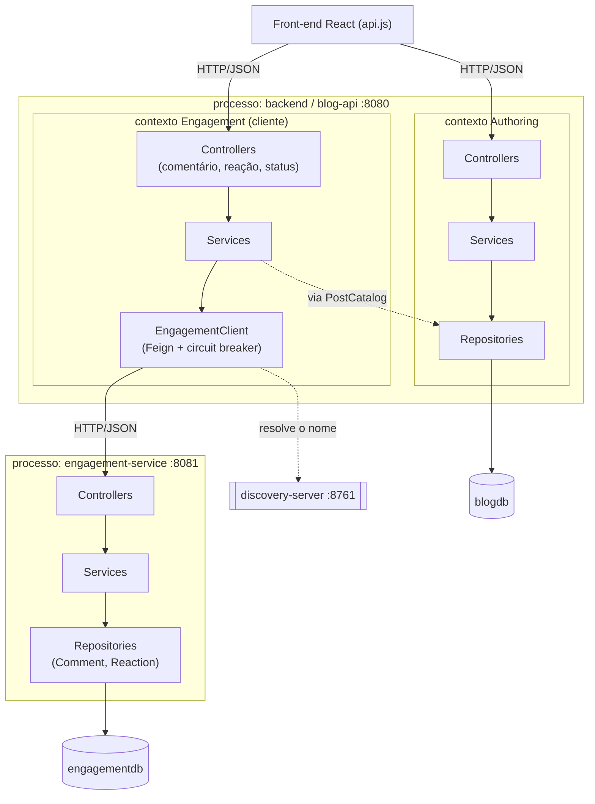
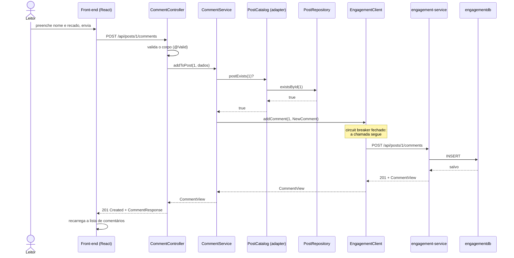
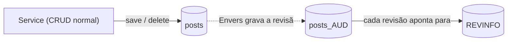

# arquitetura da solução

este documento explica como o blog foi construído. a ideia aqui é registrar as decisões e mostrar como o código está organizado de verdade, não uma versão idealizada.

a solução cresceu em três etapas, e o documento acompanha essa ordem. a primeira entrega montou uma base em camadas e bounded contexts, dentro de um único processo. a segunda amadureceu a camada de persistência e adicionou histórico de dados — detalhado no final deste documento e, com profundidade, em [PERSISTENCIA.md](PERSISTENCIA.md). a terceira partiu o sistema: um dos contextos saiu do monólito e virou um microsserviço com processo, banco e deploy próprios, e os dois passaram a conversar por rede. o que mudou está resumido no final e detalhado em [MICROSSERVICO.md](MICROSSERVICO.md).

o monólito descrito abaixo continua existindo e continua sendo o coração do sistema — ele guarda posts e autores e é a porta de entrada da API. o que ele deixou de ser é o único processo.

## visão geral

a aplicação é um blog simples. autores escrevem posts, posts começam como rascunho e podem ser publicados, leitores deixam comentários e reagem aos posts. são quatro entidades no total: autor, post, comentário e reação — esta última nasceu na terceira entrega, já dentro do microsserviço.

o sistema tem cinco peças que rodam separadas:

- **`backend` (blog-api, porta 8080)** — o monólito Spring Boot: posts, autores, e a API que o navegador consome
- **`engagement-service` (porta 8081)** — o microsserviço Spring Boot: comentários e reações
- **`discovery-server` (porta 8761)** — o registro de serviços (Eureka), por onde os dois se encontram
- **`config-server` (porta 8888)** — a configuração central dos dois serviços de negócio
- **`frontend` (porta 5173)** — a aplicação React (Vite), que fala apenas com o monólito

os dois do meio são infraestrutura: não têm domínio nem banco. existem porque, com mais de um processo, aparecem duas perguntas que um monólito nunca precisou fazer — *onde está o outro serviço?* e *de onde vêm as propriedades dele?*

cada serviço tem o seu próprio H2 em memória: `blogdb` no monólito, `engagementdb` no microsserviço. um banco por serviço é o que torna a separação real, e não apenas de código — não existe junção possível entre `posts` e `comments`. os bancos zeram a cada restart, o que é proposital: queremos algo que rode sem instalar nada. trocar por um banco real é mexer no `application.yml` de cada serviço, porque o acesso a dados passa todo pela camada de repositório.

## por que um monólito em camadas

o enunciado da primeira entrega pedia uma base que pudesse evoluir para microsserviços depois. por isso o código nasceu separado por contexto e por camada, mesmo sendo um único processo — e foi essa separação que, na terceira entrega, permitiu mover um contexto de processo em vez de reescrevê-lo. cada requisição percorre sempre o mesmo caminho:

```
controller  ->  service  ->  repository  ->  banco
```

cada camada tem uma responsabilidade só:

- o controller cuida do HTTP. recebe a requisição, valida o formato do que chegou e devolve o status certo. ele não tem regra de negócio.
- o service tem as regras. é ele quem decide que email não pode repetir, que um post precisa de um autor existente, que um post já publicado não publica de novo.
- o repository fala com o banco. é uma interface do Spring Data, então não escrevemos SQL na mão para o básico.

essa separação é o que mantém o código fácil de mexer. se a regra de publicar mudar, mexo no service e no domínio, não no controller nem no repositório.

no lado do engajamento esse caminho ficou um degrau mais longo, e vale registrar a diferença: o controller e o service continuam onde estavam, mas o que era o repositório passou a ser um cliente HTTP, e o banco do outro lado é de outro serviço:

```
controller  ->  service  ->  cliente HTTP  -->|rede|-->  microsserviço  ->  banco
```

o serviço de comentário, no monólito, deixou de gravar dado e passou a compor: valida o que é da sua alçada (o post existe?) e delega o resto a quem é dono. o desaparecimento do `@Transactional` nesse service é o sinal mais claro dessa mudança — não há mais transação local para abrir, e abrir uma seria pior do que inútil, porque manteria uma conexão do pool presa enquanto a chamada de rede espera resposta.

## bounded contexts

em vez de jogar as entidades juntas, separei o domínio em dois contextos, seguindo a ideia de bounded context do DDD:

- **authoring**: o trabalho de quem produz conteúdo. cuida de autor e post.
- **engagement**: a interação de quem lê. cuida de comentário e, desde a terceira entrega, de reação.

na primeira e na segunda entrega os dois contextos eram pacotes do mesmo processo. na terceira, o de engajamento saiu: hoje ele é um projeto separado, `engagement-service`, com o próprio `pom.xml`, o próprio banco e o próprio deploy. **a fronteira do bounded context virou a fronteira do serviço** — que é exatamente o que a divisão em contextos existia para permitir.

no monólito, o pacote `engagement` continua existindo, mas com outro conteúdo: em vez do domínio e do repositório, ele guarda o cliente que fala com o microsserviço.

```
com.blog                                  (backend / blog-api)
├── authoring
│   ├── domain        (Author, Post, PostStatus)
│   ├── repository    (AuthorRepository, PostRepository)
│   ├── service       (AuthorService, PostService, PostHistoryService, AuthorHistoryService, PostCatalogAdapter)
│   └── web           (AuthorController, PostController, dto)
├── engagement                            <- agora um contexto CLIENTE
│   ├── client        (EngagementClient, EngagementErrorDecoder, EngagementFallbackFactory, dto)
│   ├── service       (PostCatalog, CommentService, ReactionService, EngagementStatusService,
│   │                  EngagementCleanupListener)
│   └── web           (CommentController, ReactionController, EngagementStatusController, dto)
└── shared
    ├── config        (CorsConfig, DataSeeder, PersistenceConfig)
    ├── event         (PostDeletedEvent)
    ├── exception     (ResourceNotFoundException, BusinessRuleException,
    │                  ServiceUnavailableException, InvalidRequestException)
    └── web           (GlobalExceptionHandler, ApiError)

com.blog.engagement                       (engagement-service)
├── domain            (Comment, Reaction, ReactionType)
├── repository        (CommentRepository, ReactionRepository, ReactionCount)
├── service           (CommentService, ReactionService, EngagementCleanupService)
├── web               (CommentController, ReactionController, PostEngagementController,
│                      EngagementPingController, dto)
├── config            (DataSeeder)
└── shared            (ApiError, GlobalExceptionHandler, exceções)
```

o ponto importante sempre foi como os dois contextos se falam sem ficarem grudados. um comentário precisa saber se o post existe antes de ser salvo, mas o engajamento não enxerga a entidade `Post` nem o repositório de authoring. em vez disso, o engajamento define uma interface chamada `PostCatalog` com um único método: "esse post existe?". quem implementa essa interface é o `PostCatalogAdapter`, que mora no lado de authoring e usa o `PostRepository` por baixo.

**essa interface não mudou uma linha na terceira entrega, e isso é o resultado mais satisfatório dela.** o que era uma chamada local hoje protege uma chamada de rede: antes de a requisição sair da máquina, o monólito confirma que o post existe. o que virou rede foi o outro lado — o `CommentRepository` deu lugar ao `EngagementClient`.

vale notar que a checagem ficou do lado de cá, e não passou a ser feita pelo microsserviço. quem é dono do post é o monólito; se o engajamento tivesse que perguntar de volta, os dois processos passariam a depender um do outro em círculo. como está, a dependência é de mão única — monólito → engajamento — e o microsserviço sobe e responde sozinho, tratando o `postId` como um identificador externo e opaco.

outra decisão parecida: o post guarda o autor por id (`authorId`), não como um objeto `Author` embutido. cada um é um aggregate com seu próprio ciclo de vida. quando a API precisa mostrar o nome do autor junto do post, é o `PostService` que faz essa busca e monta a resposta.

## diagrama de componentes

mostra as peças reais do sistema e quem depende de quem. as setas seguem o sentido das dependências no código; a caixa pontilhada marca a fronteira de processo.

para facilitar a visualização, cada contexto aparece com as suas camadas, e não classe por classe.



duas setas merecem atenção, porque são as duas fronteiras do sistema:

- a tracejada **`via PostCatalog`** é onde os dois contextos se tocam dentro do monólito. o service de engajamento checa se o post existe através da interface que ele mesmo declara, e o lado de authoring a implementa no `PostCatalogAdapter`. é a mesma seta das entregas anteriores.
- a cheia do **`EngagementClient` para os controllers do microsserviço** é a fronteira de processo. ela atravessa a rede, e por isso é a única que pode falhar de um jeito que nenhuma chamada local falha: pode não responder. tudo o que existe de circuit breaker, fallback e tradução de erro na terceira entrega existe por causa dessa seta.

note também o que **não** aparece: nenhuma seta do front para o microsserviço, e nenhuma seta do microsserviço de volta para o monólito. a primeira ausência é a decisão de manter uma porta de entrada só; a segunda é a de manter a dependência de mão única.

## diagrama de sequência

este é o fluxo de adicionar um comentário a um post — o mesmo que as entregas anteriores documentavam, agora atravessando dois processos. escolhi mantê-lo justamente para que a comparação seja possível: o começo e o fim são idênticos, e o meio mudou de natureza.



os dois caminhos de erro, e a diferença entre eles, são o que este diagrama existe para mostrar:

- **o post não existe.** o `CommentService` lança `ResourceNotFoundException` antes de chamar o cliente, o handler global traduz para 404 e nada sai da máquina. é o mesmo comportamento de antes.
- **o microsserviço não responde.** o fallback do cliente lança `ServiceUnavailableException` e o handler traduz para **503**. esse caminho não existia antes da terceira entrega, porque antes não havia como o comentário estar indisponível enquanto o resto do sistema funciona.

o segundo caso é o que o front trata mostrando o post normalmente e avisando só na seção da conversa. os detalhes estão em [MICROSSERVICO.md](MICROSSERVICO.md).

## como o front conversa com o back

o front é uma aplicação React separada, servida pelo Vite em outra porta (5173). todas as chamadas saem de um arquivo só, o `api.js`, que concentra a URL base e o tratamento de erro. os componentes não fazem `fetch` na mão, eles chamam funções como `api.listPosts()` ou `api.addComment()`.

como front e back rodam em portas diferentes, o navegador trata como origens distintas e o CORS entra em ação. por isso o back tem o `CorsConfig`, que libera a origem do front (essa origem fica no `application.yml`, não chumbada no código). as respostas de erro seguem sempre o mesmo formato (o `ApiError`), então o front consegue ler a mensagem e mostrar pro usuário de um jeito previsível.

com a chegada do microsserviço, isso **não** mudou, e a decisão é deliberada: o navegador continua falando com uma origem só. o front não conhece o `engagement-service`, não faz descoberta de serviço e não tem uma segunda base url — comentários e reações são alcançados através do monólito, que fala com o outro processo por dentro. em troca, o monólito ganhou rotas espelho para as reações. o balanço dessa escolha, e o API Gateway que seria a resposta certa em um sistema maior, estão discutidos em [MICROSSERVICO.md](MICROSSERVICO.md).

o que o front ganhou de novo foi um componente que só faz sentido em arquitetura distribuída: um selo no cabeçalho que diz se a conversa e as reações estão disponíveis agora. um pedaço do sistema pode cair sozinho, e o leitor merece saber disso antes de escrever um comentário e receber erro.

## tratamento de erros

em vez de espalhar try/catch pelos controllers, o tratamento fica num lugar só: o `GlobalExceptionHandler`. ele escuta as exceções do domínio e da persistência e traduz cada uma para um status HTTP:

- `ResourceNotFoundException` vira 404
- `BusinessRuleException` vira 409 (conflito com uma regra, tipo email duplicado)
- `OptimisticLockingFailureException` vira 409 (travamento otimista: outra operação já mexeu no mesmo registro)
- `DataIntegrityViolationException` vira 409 (violação de uma restrição do banco, tipo email único numa corrida)
- `ServiceUnavailableException` vira 503 (o microsserviço de engajamento não respondeu)
- `InvalidRequestException` vira 400 (outro serviço recusou a requisição por validação)
- falha de validação de DTO vira 400, com a lista de campos que falharam

isso mantém os controllers limpos e garante que a API responde erro sempre do mesmo jeito. os dois mapeamentos de 409 ligados à persistência entraram na segunda entrega, junto com o `@Version`, para que um conflito de concorrência não escape como 500.

os dois últimos entraram na terceira, e existem pelo mesmo motivo um do outro: erro que atravessa a fronteira de rede precisa continuar significando a mesma coisa. o 503 diz "a requisição estava certa, o sistema é que está com uma peça faltando, tente mais tarde" — sem ele, uma queda do engajamento apareceria como 500 e o front não teria como distinguir de um bug. o 400 repassa a recusa de quem é dono da regra, em vez de transformar erro do cliente em erro do servidor. o microsserviço tem um handler equivalente, com o mesmo envelope de resposta, e é essa simetria que permite ao monólito ler a mensagem original e mostrá-la ao leitor.

## camada de persistência e histórico

a segunda entrega concentrou o trabalho na camada de persistência, sem mexer na organização em camadas e contextos descrita acima. o modelo são aggregates que se referenciam por id, e a modelagem foi apertada olhando para os caminhos de consulta: os posts ganharam índices em `author_id`, `status` e `created_at`, e os comentários um índice em `post_id`, cada um cobrindo uma consulta que a aplicação de fato faz. todas as entidades passaram a ter um campo `@Version`, o que liga o travamento otimista e impede que duas atualizações concorrentes se sobrescrevam em silêncio.

essa decisão de modelagem — referência por id, sem `@ManyToOne` nem chave estrangeira entre aggregates — foi a que tornou a terceira entrega possível. quando o comentário mudou de processo, ele levou o mapeamento inteiro consigo: o `postId` que era uma referência solta dentro de um banco passou a ser um identificador que atravessa a rede, e o formato já era o certo. não havia relação de banco para desmontar.

a novidade maior é o histórico de mudanças. em vez de tabelas de auditoria escritas na mão, usei o Hibernate Envers, que é a extensão do próprio Hibernate para isso: anotar a entidade com `@Audited` faz o Envers manter, ao lado de cada tabela, uma tabela espelho com sufixo `_AUD` e uma tabela global `REVINFO` que numera as revisões. a cada transação que insere, altera ou remove uma entidade auditada, uma linha de histórico é gravada com o estado daquele momento e o tipo da operação. o registro é um efeito da transação fechar; os services fazem o CRUD normal e não sabem que existe auditoria.

para consultar, os repositórios de post e de autor estendem também o `RevisionRepository` do Spring Data Envers, que dá métodos como `findRevisions(id)` sem escrever consulta nenhuma. isso é exposto na API em `GET /api/posts/{id}/history` e `GET /api/authors/{id}/history`, e o front mostra a linha do tempo na página do post. um post já apagado continua tendo histórico, que é justamente o ponto de uma trilha de auditoria.

a auditoria do comentário continua existindo, agora dentro do microsserviço: a tabela `comments_AUD` mudou de banco junto com a entidade, com a mesma anotação e a mesma configuração de `store_data_at_delete`. há um teste no `engagement-service` só para garantir que essa conquista da segunda entrega não se perdeu na mudança de processo. a reação, por outro lado, **não** é auditada — o motivo está em [MICROSSERVICO.md](MICROSSERVICO.md).



a seta tracejada é o Envers agindo por baixo: a aplicação escreve na tabela `posts`, e a linha de histórico correspondente vai para `posts_AUD`, amarrada a uma revisão em `REVINFO`. o desenho completo dessa camada — modelagem, mapeamento JPA, repositórios com exemplos de uso, a configuração do Envers e a estratégia de testes — está em [PERSISTENCIA.md](PERSISTENCIA.md).

## a terceira entrega: o corte

o contexto de engajamento saiu do monólito e virou o `engagement-service`, um processo com banco e deploy próprios. a escolha do candidato não foi por conveniência: era o único contexto que não compartilhava entidade nenhuma com o resto, que dependia do outro lado apenas por uma interface declarada por ele mesmo, e que tem um ciclo de vida de negócio próprio. onde o acoplamento é assim, mover de processo é cirurgia pequena.

do outro lado da fronteira nasceu também uma capacidade nova, as **reações** — porque mover código existente prova que a fronteira estava no lugar, mas só desenvolver algo novo lá prova que o serviço é autônomo de verdade. o vocabulário de reações, a regra de "uma de cada tipo por leitor" e a contagem vivem inteiramente no microsserviço; o monólito não sabe quais tipos existem.

as peças de Spring Cloud que sustentam a conversa:

- **Eureka** para descoberta: o monólito acha o outro serviço pelo nome lógico, sem host nem porta no código
- **OpenFeign** para a chamada: a fronteira de rede é declarada como uma interface Java
- **Spring Cloud LoadBalancer** (junto do Eureka) para escolher entre instâncias
- **Resilience4j** para o circuit breaker: quando o engajamento cai, as chamadas falham rápido em vez de segurar threads
- **Spring Cloud Config** para a configuração: cada propriedade de ambiente passa a ter um dono. o endereço do Eureka estava escrito nos dois serviços, e duas cópias de um endereço são uma delas esperando para ficar desatualizada. a linha que usei para dividir: ajuste de **ambiente** (endereço, limite, intervalo) vai para o servidor central; decisão de **código** (o banco, a porta, ligar o circuit breaker) fica no serviço

e as decisões que a distribuição obrigou a tomar:

- erro traduzido na travessia (404 continua 404, queda vira 503), com o mesmo envelope de resposta nos dois serviços
- fallback que sabe distinguir "o serviço falhou" de "o serviço disse não"
- consistência entre bancos por evento de domínio (`PostDeletedEvent`), com entrega por melhor esforço e operação idempotente do outro lado
- degradação graciosa na interface: o post continua legível quando a conversa está fora do ar

o detalhamento de tudo isso — topologia, configuração, formatos, testes e o que ficou de fora — está em [MICROSSERVICO.md](MICROSSERVICO.md).

## resumo das decisões

- começou monólito, mas já dividido por contexto e camada, pensando na evolução pra microsserviços — e a evolução aconteceu exatamente na linha desenhada
- contextos se falam por uma interface (`PostCatalog`), não por acesso direto; a interface sobreviveu intacta à mudança de processo
- post referencia autor por id, e comentário referencia post por id, tratando cada um como aggregate independente — o que virou o formato natural para um id atravessar a rede
- H2 em memória pra rodar sem setup, um banco por serviço, isolado atrás da camada de repositório
- índices e travamento otimista (`@Version`) na modelagem, pensando em integridade e nos caminhos de consulta
- histórico de dados com Hibernate Envers, consultado por repositórios Spring Data (`RevisionRepository`); a auditoria do comentário migrou junto com a entidade
- regras de negócio dentro do service e do domínio do serviço que é dono delas, nunca no controller e nunca duplicadas do outro lado da fronteira
- tratamento de erro e formato de resposta centralizados, e o mesmo envelope nos dois serviços
- descoberta de serviços em vez de endereço fixo; configuração central em vez de propriedade duplicada; circuit breaker em vez de esperar timeout; evento de domínio em vez de chamada direta entre contextos
