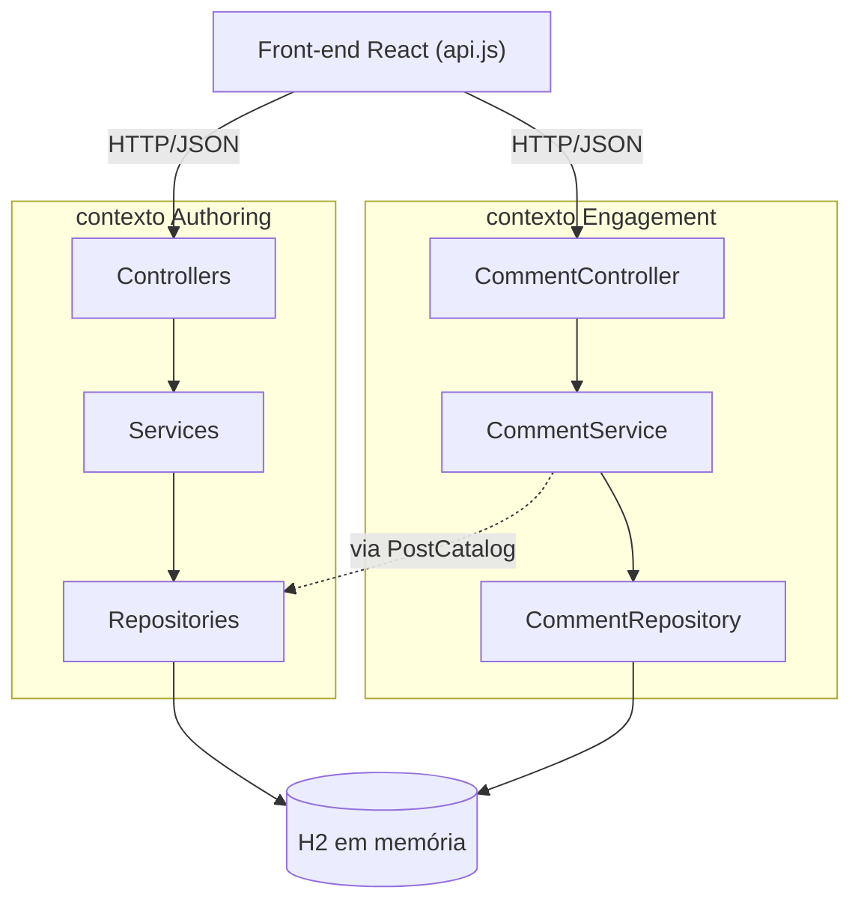
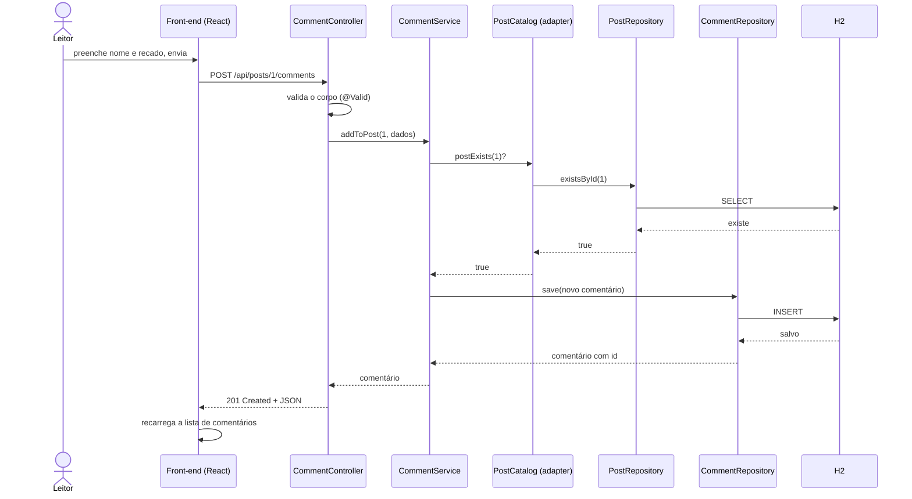
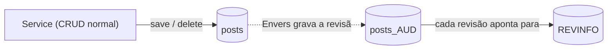

# arquitetura da solução

este documento explica como o blog foi construído: um monólito em Spring Boot com um front-end React conversando com ele por uma API REST. a ideia aqui é registrar as decisões e mostrar como o código está organizado de verdade, não uma versão idealizada. a primeira entrega montou essa base em camadas e bounded contexts; a segunda amadureceu a camada de persistência e adicionou histórico de dados, o que está detalhado no final deste documento e, com mais profundidade, em [PERSISTENCIA.md](PERSISTENCIA.md).

## visão geral

a aplicação é um blog simples. autores escrevem posts, posts começam como rascunho e podem ser publicados, e leitores deixam comentários nos posts. são três entidades no total: autor, post e comentário.

o sistema tem duas peças que rodam separadas:

- um back-end Spring Boot, que guarda os dados e expõe a API REST
- um front-end React (Vite), que consome essa API no navegador

o banco é o H2 em memória. ele zera a cada restart, o que é proposital nesta etapa: queremos algo que rode sem instalar nada. trocar por um banco real depois é só mexer no `application.yml`, porque o acesso a dados passa todo pela camada de repositório.

## por que um monólito em camadas

o enunciado pede uma base que possa evoluir para microsserviços depois. por isso o código já nasce separado por contexto e por camada, mesmo sendo um único processo. cada requisição percorre sempre o mesmo caminho:

```
controller  ->  service  ->  repository  ->  banco
```

cada camada tem uma responsabilidade só:

- o controller cuida do HTTP. recebe a requisição, valida o formato do que chegou e devolve o status certo. ele não tem regra de negócio.
- o service tem as regras. é ele quem decide que email não pode repetir, que um post precisa de um autor existente, que um post já publicado não publica de novo.
- o repository fala com o banco. é uma interface do Spring Data, então não escrevemos SQL na mão para o básico.

essa separação é o que mantém o código fácil de mexer. se a regra de publicar mudar, mexo no service e no domínio, não no controller nem no repositório.

## bounded contexts

em vez de jogar as três entidades juntas, separei o domínio em dois contextos, seguindo a ideia de bounded context do DDD:

- **authoring**: o trabalho de quem produz conteúdo. cuida de autor e post.
- **engagement**: a interação de quem lê. cuida de comentário.

a separação aparece direto na estrutura de pacotes:

```
com.blog
├── authoring
│   ├── domain        (Author, Post, PostStatus)
│   ├── repository    (AuthorRepository, PostRepository)
│   ├── service       (AuthorService, PostService, PostHistoryService, AuthorHistoryService, PostCatalogAdapter)
│   └── web           (AuthorController, PostController, dto)
├── engagement
│   ├── domain        (Comment)
│   ├── repository    (CommentRepository)
│   ├── service       (CommentService, PostCatalog)
│   └── web           (CommentController, dto)
└── shared
    ├── config        (CorsConfig, DataSeeder, PersistenceConfig)
    ├── exception     (ResourceNotFoundException, BusinessRuleException)
    └── web           (GlobalExceptionHandler, ApiError)
```

o ponto importante é como os dois contextos se falam sem ficarem grudados. um comentário precisa saber se o post existe antes de ser salvo, mas o contexto de engajamento não enxerga a entidade `Post` nem o repositório de authoring. em vez disso, o engajamento define uma interface chamada `PostCatalog` com um único método: "esse post existe?". quem implementa essa interface é o `PostCatalogAdapter`, que mora no lado de authoring e usa o `PostRepository` por baixo.

assim a dependência fica invertida e explícita. o engajamento depende de uma abstração que ele mesmo declara, e o authoring é quem se conecta nela. se um dia esses contextos virarem serviços separados, esse adaptador é o ponto que vira uma chamada de rede, e o resto do código de comentário nem percebe. foi a única abstração que adicionei de propósito, justamente porque resolve um problema real de acoplamento entre contextos.

outra decisão parecida: o post guarda o autor por id (`authorId`), não como um objeto `Author` embutido. cada um é um aggregate com seu próprio ciclo de vida. quando a API precisa mostrar o nome do autor junto do post, é o `PostService` que faz essa busca e monta a resposta.

## diagrama de componentes

mostra as peças reais do sistema e quem depende de quem. as setas seguem o sentido das dependências no código.

para facilitar a visualização, cada contexto aparece com as suas três camadas (controller, service, repository), e não classe por classe. a linha tracejada é a única ponte entre os dois contextos.



a seta tracejada (`via PostCatalog`) é o único ponto onde os dois contextos se tocam: o `CommentService` checa se o post existe através da interface `PostCatalog`, que o lado de authoring implementa no `PostCatalogAdapter`. fora isso, cada contexto vive sozinho.

## diagrama de sequência

este é o fluxo de adicionar um comentário a um post. escolhi ele porque passa pelas duas camadas de negócio e mostra a checagem entre contextos acontecendo.



se o post não existisse, o `CommentService` lançaria uma `ResourceNotFoundException`, o `GlobalExceptionHandler` traduziria para 404, e o front mostraria a mensagem de erro. esse caminho de erro vale para toda a API, não só para comentários.

## como o front conversa com o back

o front é uma aplicação React separada, servida pelo Vite em outra porta (5173). todas as chamadas saem de um arquivo só, o `api.js`, que concentra a URL base e o tratamento de erro. os componentes não fazem `fetch` na mão, eles chamam funções como `api.listPosts()` ou `api.addComment()`.

como front e back rodam em portas diferentes, o navegador trata como origens distintas e o CORS entra em ação. por isso o back tem o `CorsConfig`, que libera a origem do front (essa origem fica no `application.yml`, não chumbada no código). as respostas de erro seguem sempre o mesmo formato (o `ApiError`), então o front consegue ler a mensagem e mostrar pro usuário de um jeito previsível.

## tratamento de erros

em vez de espalhar try/catch pelos controllers, o tratamento fica num lugar só: o `GlobalExceptionHandler`. ele escuta as exceções do domínio e da persistência e traduz cada uma para um status HTTP:

- `ResourceNotFoundException` vira 404
- `BusinessRuleException` vira 409 (conflito com uma regra, tipo email duplicado)
- `OptimisticLockingFailureException` vira 409 (travamento otimista: outra operação já mexeu no mesmo registro)
- `DataIntegrityViolationException` vira 409 (violação de uma restrição do banco, tipo email único numa corrida)
- falha de validação de DTO vira 400, com a lista de campos que falharam

isso mantém os controllers limpos e garante que a API responde erro sempre do mesmo jeito. os dois mapeamentos de 409 ligados à persistência entraram na segunda entrega, junto com o `@Version`, para que um conflito de concorrência não escape como 500.

## camada de persistência e histórico

a segunda entrega concentrou o trabalho na camada de persistência, sem mexer na organização em camadas e contextos descrita acima. o modelo continua sendo três aggregates que se referenciam por id, mas agora a modelagem foi apertada olhando para os caminhos de consulta: os posts ganharam índices em `author_id`, `status` e `created_at`, e os comentários um índice em `post_id`, cada um cobrindo uma consulta que a aplicação de fato faz. todas as entidades passaram a ter um campo `@Version`, o que liga o travamento otimista e impede que duas atualizações concorrentes se sobrescrevam em silêncio.

a novidade maior é o histórico de mudanças. em vez de tabelas de auditoria escritas na mão, usei o Hibernate Envers, que é a extensão do próprio Hibernate para isso: anotar a entidade com `@Audited` faz o Envers manter, ao lado de cada tabela, uma tabela espelho com sufixo `_AUD` e uma tabela global `REVINFO` que numera as revisões. a cada transação que insere, altera ou remove uma entidade auditada, uma linha de histórico é gravada com o estado daquele momento e o tipo da operação. o registro é um efeito da transação fechar; os services fazem o CRUD normal e não sabem que existe auditoria.

para consultar, os repositórios de post e de autor estendem também o `RevisionRepository` do Spring Data Envers, que dá métodos como `findRevisions(id)` sem escrever consulta nenhuma. isso é exposto na API em `GET /api/posts/{id}/history` e `GET /api/authors/{id}/history`, e o front mostra a linha do tempo na página do post. um post já apagado continua tendo histórico, que é justamente o ponto de uma trilha de auditoria.



a seta tracejada é o Envers agindo por baixo: a aplicação escreve na tabela `posts`, e a linha de histórico correspondente vai para `posts_AUD`, amarrada a uma revisão em `REVINFO`. o desenho completo dessa camada — modelagem, mapeamento JPA, repositórios com exemplos de uso, a configuração do Envers e a estratégia de testes — está em [PERSISTENCIA.md](PERSISTENCIA.md).

## resumo das decisões

- monólito, mas já dividido por contexto e camada, pensando na evolução pra microsserviços
- contextos se falam por uma interface (`PostCatalog`), não por acesso direto, pra manter o acoplamento explícito e fácil de cortar depois
- post referencia autor por id, tratando cada um como aggregate independente
- H2 em memória pra rodar sem setup, isolado atrás da camada de repositório pra trocar fácil
- índices e travamento otimista (`@Version`) na modelagem, pensando em integridade e nos caminhos de consulta
- histórico de dados com Hibernate Envers, consultado por repositórios Spring Data (`RevisionRepository`)
- regras de negócio dentro do service e do domínio, nunca no controller
- tratamento de erro e formato de resposta centralizados
