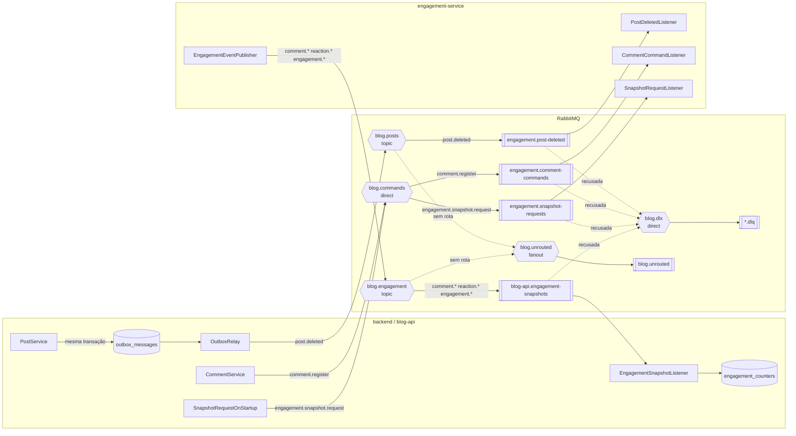
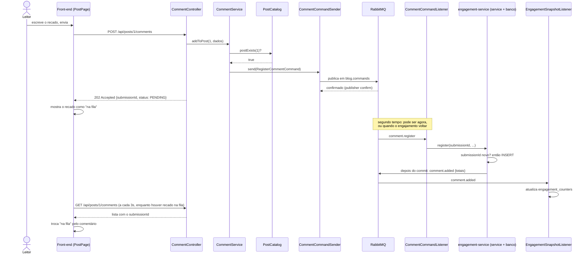
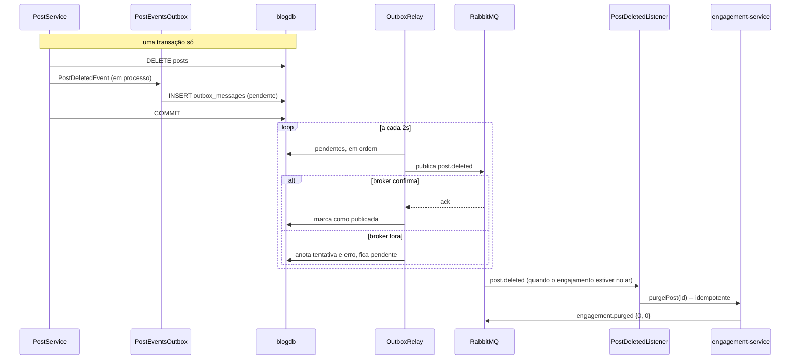
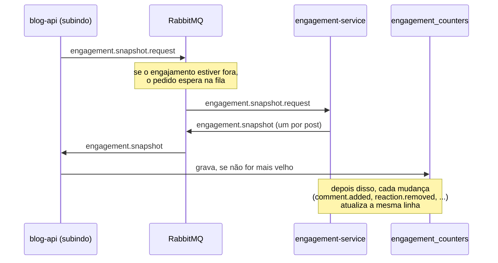

# arquitetura orientada a eventos

este documento detalha a quarta entrega: a refatoração do sistema para uma arquitetura orientada a eventos, com RabbitMQ como broker de mensagens. a arquitetura geral continua em [ARQUITETURA.md](ARQUITETURA.md), a camada de persistência em [PERSISTENCIA.md](PERSISTENCIA.md) e a extração do microsserviço, com a comunicação por HTTP que continua valendo, em [MICROSSERVICO.md](MICROSSERVICO.md). o que segue é o recorte da mensageria.

a terceira entrega terminou com uma lista honesta do que ficou de fora, e um dos itens era este: *"mensageria e padrão outbox — a limpeza de post apagado é uma chamada síncrona por melhor esforço. um broker daria reentrega e fecharia a janela de inconsistência."* o código já apontava onde isso entraria — o comentário do `PostDeletedEvent` dizia que, se um dia o evento virasse mensagem em um broker, *"o único ponto a trocar é a entrega, não quem publica nem quem reage"*. esta entrega cobra as duas promessas, e vai além delas: a escrita de comentários e os contadores de engajamento também passaram a correr por eventos.

## o ponto de partida: onde o sistema estava acoplado

antes de mudar qualquer coisa, a pergunta foi: *em que pontos um serviço depende de o outro estar de pé naquele exato instante, sem precisar?* a terceira entrega tinha quatro:

| interação | como era (3ª entrega) | o problema |
| --- | --- | --- |
| leitor comenta | HTTP síncrono, monólito → engajamento | com o engajamento fora, o formulário **saía da tela**: não havia onde guardar o recado |
| post é apagado | HTTP depois do commit, por melhor esforço | com o engajamento fora, a conversa do post ficava **órfã para sempre** — a falha ia para o log e ninguém tentava de novo |
| estante mostra os posts | não mostrava engajamento nenhum | mostrar "3 recados" em cada cartão exigiria uma chamada de rede **por post**, e a estante passaria a cair junto com o engajamento |
| limpeza do engajamento | o monólito chamava `DELETE /api/posts/{id}/engagement` | o monólito precisava **conhecer** um endpoint de outro serviço só para avisar de um fato dele mesmo |

os quatro têm a mesma raiz: comunicação síncrona usada onde quem chama **não precisa da resposta para seguir**. é aí que um evento ou um comando em fila é melhor que uma chamada. e o contrário também vale: onde quem chama precisa da resposta agora, HTTP continua sendo a ferramenta certa — e continua no sistema.

## prós e contras da arquitetura orientada a eventos

a decisão de adotar eventos não é "eventos são melhores". é uma troca, e vale escrever os dois lados antes de escolher onde aplicar.

### o que se ganha

- **desacoplamento temporal.** quem publica não precisa que quem consome esteja no ar. a mensagem espera na fila. é o ganho mais direto de resiliência: a queda de um serviço deixa de ser a falha imediata do outro.
- **desacoplamento de conhecimento.** quem publica um evento não sabe quem assina. o monólito anuncia "o post 7 foi apagado" e não sabe que existe um serviço de engajamento interessado; um terceiro serviço pode assinar amanhã sem uma linha mudar no monólito.
- **absorção de picos e escala horizontal.** uma fila com vários consumidores concorrentes divide a carga automaticamente. subir mais instâncias de quem consome aumenta a vazão sem mexer em quem produz.
- **transações locais em vez de distribuídas.** cada serviço confirma a própria transação e se coordena pelos eventos, em vez de uma transação que abranja dois bancos (que não existe entre serviços, ou existe com um custo enorme).
- **dados derivados sem acoplamento.** um serviço pode manter uma cópia de leitura do dado de outro, alimentada por eventos, e responder consultas sem perguntar a ninguém.

### o que se paga

- **consistência eventual.** o comentário enviado não aparece na hora: ele foi *aceito*, não *gravado*. a interface precisa lidar com um estado intermediário ("na fila") que não existia antes.
- **entrega pelo menos uma vez.** o broker garante que a mensagem chega, não que chega uma vez só. todo consumidor precisa ser **idempotente**, ou a reentrega vira dado duplicado.
- **ordem não garantida.** com retentativas e consumidores concorrentes, uma mensagem mais velha pode chegar depois de uma mais nova.
- **uma peça nova que pode cair.** o broker é infraestrutura crítica: precisa ser operado, monitorado e ter o que fazer quando está fora.
- **depuração mais difícil.** o fluxo não está mais num stack trace; está espalhado entre processos, filas e logs.
- **o contrato vira implícito.** o formato da mensagem é uma API pública, mas sem o conforto de um endpoint documentado: se o produtor muda um campo, o consumidor quebra em silêncio.

cada custo desses tem uma resposta concreta neste sistema, e elas estão nas seções seguintes: o estado "na fila" na interface, os três tipos de idempotência, a regra "o mais recente vence", o outbox para quando o broker cai, o diagnóstico com os eventos pendentes, e o contrato escrito neste documento.

### quando vale a pena

orientar a eventos compensa quando pelo menos uma destas é verdade:

- **o chamador não precisa da resposta para seguir.** enviar um comentário, avisar que algo aconteceu.
- **o fato interessa a mais de um, ou a quem ainda não existe.** um post apagado interessa ao engajamento hoje, e poderia interessar a uma busca, a um cache ou a uma notificação amanhã.
- **produtor e consumidor têm disponibilidade ou ritmo diferentes.** picos de escrita, serviços que caem em horários diferentes, processamento mais lento que a chegada.
- **um serviço precisa ler dados de outro com frequência.** manter uma cópia alimentada por eventos é mais barato e mais resiliente do que perguntar a cada leitura.

### quando não vale

- **consultas.** ler a conversa de um post precisa da resposta agora. fazer isso por fila (request/reply sobre o broker) seria HTTP com passos a mais: um canal de resposta, uma correlação, um timeout — e nenhum ganho, porque o leitor continuaria esperando.
- **regras que o usuário precisa ver na hora.** reagir duas vezes com o mesmo tipo é recusado com 409, e a barra de reações precisa do resumo atualizado para redesenhar. por fila, a recusa chegaria tarde demais para a interface.
- **poucos participantes e consistência forte.** se dois componentes precisam concordar imediatamente e sempre, eventos adicionam complexidade sem ganho.

### o critério usado aqui

a linha que dividiu o que virou mensagem do que continuou HTTP foi uma pergunta só: **o chamador precisa da resposta para seguir?**

| interação | precisa da resposta? | ficou como |
| --- | --- | --- |
| ler a conversa de um post | sim, o leitor abriu a página | HTTP (Feign) |
| reagir / desfazer reação | sim, a barra redesenha com o resumo e o 409 importa | HTTP (Feign) |
| apagar um comentário | sim, raro, e o 404 importa | HTTP (Feign) |
| ping / diagnóstico | sim, é a própria pergunta | HTTP (Feign) |
| **enviar um comentário** | não, basta saber que foi aceito | **comando em fila** |
| **avisar que um post foi apagado** | não, é um fato consumado | **evento, via outbox** |
| **manter contadores na estante** | não, é dado derivado | **eventos de estado** |
| **reconstruir os contadores** | não, a resposta pode chegar depois | **comando em fila** |

o resultado é um sistema híbrido, e isso é deliberado. a arquitetura orientada a eventos substituiu o acoplamento síncrono **onde ele não era necessário**, e não em todo lugar.

## a topologia

o broker é um RabbitMQ 3.13, que sobe por `docker compose` (o [docker-compose.yml](../docker-compose.yml) da raiz). nenhuma fila é criada à mão: exchanges, filas e bindings são declarados pelos próprios serviços como beans, e o `RabbitAdmin` do Spring os cria no broker na primeira conexão.



### os exchanges

| exchange | tipo | quem publica | por que esse tipo |
| --- | --- | --- | --- |
| `blog.posts` | topic | monólito | eventos: cada assinante escolhe por routing key o que quer ouvir (`post.deleted` hoje, `post.#` se um dia quiser todos) |
| `blog.engagement` | topic | engajamento | idem. o monólito assina `comment.*`, `reaction.*` e `engagement.*`; um serviço de notificação assinaria só `comment.added` |
| `blog.commands` | direct | monólito | comandos têm um destinatário: a routing key aponta para exatamente uma fila |
| `blog.unrouted` | fanout | (o broker) | *alternate exchange* dos dois topics: um evento que nenhuma fila assinou vem parar aqui, em vez de ser descartado em silêncio |
| `blog.dlx` | direct | (o broker) | *dead letter exchange*: a mensagem recusada por um consumidor é roteada, pelo nome da fila de origem, para a `.dlq` dela |

### as filas

| fila | dono | assina | o que acontece nela |
| --- | --- | --- | --- |
| `engagement.post-deleted` | engajamento | `blog.posts` / `post.deleted` | limpa a conversa e as reações do post apagado |
| `engagement.comment-commands` | engajamento | `blog.commands` / `comment.register` | registra o comentário enviado pelo leitor |
| `engagement.snapshot-requests` | engajamento | `blog.commands` / `engagement.snapshot.request` | republica o estado de todos os posts |
| `blog-api.engagement-snapshots` | monólito | `blog.engagement` / `comment.*`, `reaction.*`, `engagement.*` | atualiza a cópia local dos contadores |
| `<cada uma acima>.dlq` | o mesmo dono | `blog.dlx` / nome da fila | guarda o que foi recusado, para inspeção e reenvio |
| `blog.unrouted` | os dois | `blog.unrouted` | guarda eventos publicados sem nenhum assinante |

todas são duráveis, e todas as mensagens são persistentes: sobrevivem a um restart do broker (o volume do `docker-compose.yml` é o que garante o disco).

### quem declara o quê

a regra geral é que **o consumidor é dono da fila dele**: é ele quem decide o nome, a durabilidade e o que assina. o engajamento declara as três filas dele; o monólito declara a dele. os exchanges são declarados pelos dois lados, com argumentos idênticos — declarar é idempotente, e fazer dos dois lados tira a ordem de subida da equação.

há uma exceção deliberada, e ela é a diferença entre evento e comando posta em prática: **o monólito também declara as filas dos comandos que envia.**

- um **evento** é publicado para quem quiser ouvir. se ninguém assinou ainda, não é problema de quem publicou — e o alternate exchange guarda a mensagem de qualquer forma.
- um **comando** tem destinatário. se o engajamento nunca subiu contra este broker, a fila dele ainda não existe, e o comentário do leitor seria descartado. declarando daqui, o comando espera na fila até o destinatário aparecer.

o nome dos exchanges, das filas e os argumentos (dead letter exchange, alternate exchange) estão numa classe `Topology` em cada serviço, repetida — pelo mesmo motivo do `ApiError` repetido na terceira entrega: uma biblioteca comum acoplaria os dois serviços em tempo de build. se os dois lados divergirem nos argumentos de uma fila, o broker recusa a segunda declaração com `PRECONDITION_FAILED` e o serviço não sobe. é o jeito certo de uma divergência de contrato aparecer: alto e cedo.

## os padrões de mensagem

são quatro padrões de mensagem, cada um atendendo um caso de uso diferente, e três padrões de confiabilidade que os sustentam.

### 1. notificação de evento (publish/subscribe) — `post.deleted`

**o caso:** um post foi apagado no monólito, e a conversa dele vive em outro banco.

**o desenho:** o monólito publica um fato, no passado, com o mínimo necessário — o id. o engajamento assina a routing key e decide sozinho o que fazer.

```json
// exchange blog.posts, routing key post.deleted
{ "postId": 7, "deletedAt": "2026-09-27T19:30:27.102Z" }
```

```java
// engagement-service
@RabbitListener(queues = POST_DELETED_QUEUE, id = "post-deleted")
public void onPostDeleted(PostDeletedMessage event) {
    PurgeResponse removido = cleanupService.purgePost(event.postId());
    log.info("post {} apagado no monolito: {} comentario(s) e {} reacao(oes) removidos aqui", ...);
}
```

**o que mudou em relação à terceira entrega:** duas coisas. a janela de inconsistência deixou de ser permanente — com o engajamento fora, a mensagem espera na fila e é processada quando ele volta, em vez de a falha ir para o log e ninguém tentar de novo. e a direção do conhecimento se inverteu: o monólito não sabe mais que existe um endpoint de limpeza no engajamento. quem decidiu que "post apagado" importa foi o engajamento, ao assinar.

**por que notificação, e não estado:** o assinante não precisa de mais nada do post para limpar o que tem dele. carregar o post inteiro no evento seria vazar o modelo do monólito para quem não precisa dele.

### 2. comando ponto a ponto com consumidores concorrentes — `comment.register`

**o caso:** o leitor envia um comentário, e o engajamento pode estar fora do ar.

**o desenho:** o monólito valida o post (que é dele), gera um `submissionId`, põe um **comando** na fila do engajamento e responde `202 Accepted`. o engajamento consome no ritmo dele.

```json
// exchange blog.commands, routing key comment.register -> fila engagement.comment-commands
{
  "submissionId": "a07bcc1b-2cb1-48e6-a898-fddffb41ba77",
  "postId": 1,
  "authorName": "Carla",
  "content": "escrevi com o engajamento fora",
  "submittedAt": "2026-09-27T19:29:31.218Z"
}
```

três decisões nesse comando:

- **é um comando, não um evento.** está no imperativo ("registre"), tem um destinatário só, e pode ser recusado. o nome e o exchange (`direct`) deixam isso explícito.
- **o `submissionId` nasce no monólito.** é a identidade do comentário antes de ele existir. serve para o consumo idempotente do outro lado e para a interface reconhecer o próprio recado quando ele aparecer na listagem.
- **o `submittedAt` vira o `createdAt`.** se a mensagem esperou na fila, a conversa continua na ordem em que as pessoas escreveram, e não na ordem em que a fila foi drenada.

**escala:** a fila é de trabalho — cada mensagem vai para um consumidor só. subir uma segunda instância do engajamento divide a fila entre as duas sem configurar nada; dentro de cada instância, o Spring abre até `max-concurrency` consumidores quando a fila acumula (4, pelo config server). foi verificado subindo duas instâncias e enviando 20 comentários: cada uma processou 10.

**sem outbox, e por quê:** o monólito não grava nada quando o leitor comenta. o outbox resolve a escrita dupla (banco + broker); com uma escrita só, basta a **confirmação do broker** (publisher confirm): o `CommentCommandSender` só devolve depois de o broker dizer que guardou a mensagem. se a confirmação não vier, o leitor recebe 503 e o texto continua no formulário. nada é aceito para depois se perder.

### 3. transferência de estado pelo evento — `comment.*`, `reaction.*`, `engagement.*`

**o caso:** a estante quer mostrar "3 recados · 5 reações" em cada cartão, sem uma chamada de rede por post e sem cair quando o engajamento cai.

**o desenho:** a cada mudança, o engajamento publica um evento cuja routing key diz **o que aconteceu** e cujo corpo carrega **o estado resultante** — os totais do post depois da mudança, e não o delta. o monólito assina todas e mantém uma tabela local, `engagement_counters`, que a estante lê.

```json
// exchange blog.engagement, routing key reaction.added
{ "postId": 1, "comments": 3, "reactions": 4, "change": "reaction.added", "occurredAt": "2026-09-27T19:31:42.429Z" }
```

mandar o total, e não "+1", é a decisão central deste padrão:

- a mesma mensagem aplicada duas vezes dá o mesmo resultado (idempotente);
- uma mensagem perdida é corrigida pela seguinte, que traz o número certo;
- um "+1" duplicado contaria errado para sempre, e um "+1" perdido também.

a cópia local é um **modelo de leitura**, e não um aggregate: o dono do dado continua sendo o engajamento. por isso ela não é auditada, e pode ser reconstruída a qualquer momento (padrão 4). o preço é a defasagem: o número na estante pode estar alguns instantes atrás do real. a resposta da API traz o `updatedAt` justamente para isso ficar explícito.

**a dependência invertida, sem ciclo.** por HTTP, a dependência continua de mão única: monólito → engajamento. por eventos, a informação agora corre também no sentido contrário — e isso não cria o ciclo que a terceira entrega evitou, porque **quem publica não depende de quem consome**. o engajamento anuncia no exchange dele sem saber que o monólito existe; se o monólito cair, o engajamento segue funcionando e as mensagens esperam na fila.

**sem outbox, e por quê:** o publicador do engajamento é de melhor esforço, depois do commit (`@TransactionalEventListener(AFTER_COMMIT)`). se o broker estiver fora, o comentário continua gravado e a falha vai para o log. isso é aceitável aqui, e não seria para `post.deleted`, porque o que esta mensagem carrega **se corrige sozinho**: a próxima mudança no mesmo post traz o total certo, e a reconstrução refaz tudo. um fato único e irrecuperável ("o post foi apagado") mereceu outbox; um contador que se refaz, não. nem toda mensagem merece a mesma garantia, e pagar a garantia mais cara em todas seria complexidade sem retorno.

### 4. pedido assíncrono de republicação — `engagement.snapshot.request`

**o caso:** a cópia dos contadores vive no banco em memória do monólito e nasce vazia a cada restart. do outro lado, o engajamento também reinicia com o banco recriado.

**o desenho:** duas pontas, uma em cada serviço:

- o monólito, ao subir, envia o comando `engagement.snapshot.request`. o engajamento responde publicando um `engagement.snapshot` para cada post, **no exchange de eventos de sempre** — não num canal de resposta dedicado. quem pediu já assina esse exchange, e qualquer outro assinante que precise se reconstruir aproveita a mesma republicação.
- o engajamento, ao terminar de subir, anuncia o próprio estado da mesma forma, sem ninguém pedir.

a alternativa "síncrona" seria o monólito buscar tudo por HTTP no startup, o que o faria depender de o engajamento estar de pé naquele instante. pela fila, o pedido espera: se o engajamento estiver fora, ele atende quando voltar, e os contadores aparecem sem ninguém reiniciar nada.

### 5. outbox transacional (confiabilidade do publicador)

o problema que o outbox resolve é o da **escrita dupla**. apagar o post e publicar `post.deleted` são duas escritas em dois sistemas diferentes, e não existe transação que abranja o banco e o broker. qualquer ordem falha em algum cenário:

- publicar **antes** do commit anuncia uma exclusão que pode voltar atrás;
- publicar **depois** do commit perde o evento se o processo cair entre um e outro, ou se o broker estiver fora.

o outbox troca as duas escritas por uma: a mensagem é gravada numa tabela (`outbox_messages`) **na mesma transação** da exclusão do post, e um relay a leva ao broker depois.

```java
// PostEventsOutbox (authoring): @EventListener comum, síncrono, dentro da transação do delete
@EventListener
public void onPostDeleted(PostDeletedEvent event) {
    outboxWriter.record(POSTS_EXCHANGE, POST_DELETED, PostDeletedMessage.TYPE,
            new PostDeletedMessage(event.postId(), Instant.now()));
}

// OutboxWriter: MANDATORY exige a transação de quem chamou -- gravar fora dela seria
// só uma segunda escrita independente, o problema que o padrão existe para evitar
@Transactional(propagation = Propagation.MANDATORY)
public OutboxMessage record(String exchange, String routingKey, String type, Object payload) { ... }
```

o relay (`OutboxRelay`) roda a cada 2 segundos (intervalo no config server): pega as pendentes em ordem, publica cada uma, **espera a confirmação do broker** e só então marca como publicada. na primeira falha, o lote para — a falha quase sempre é o broker fora, e pular uma mensagem para publicar a seguinte inverteria a ordem dos eventos.

o `PostService` não mudou para isso. ele continua publicando o mesmo `PostDeletedEvent` interno da terceira entrega; o que mudou foi quem escuta. o `EngagementCleanupListener`, que fazia a chamada HTTP de limpeza, foi removido, e o `PostEventsOutbox` entrou no lugar.

a garantia resultante é **pelo menos uma vez**: se o processo cair entre a confirmação do broker e a marcação da linha, a mensagem sai de novo na varredura seguinte. é por isso que o padrão 6 existe.

### 6. consumidor idempotente

com entrega "pelo menos uma vez", cada consumidor precisa tolerar a mesma mensagem duas vezes. são três consumidores, e cada um usa a estratégia que o seu dado permite — não há uma solução única:

| consumidor | estratégia | como |
| --- | --- | --- |
| limpeza de post apagado | **idempotência natural** | limpar duas vezes o mesmo post remove zero na segunda e não é erro |
| registro de comentário | **chave de idempotência** | o `submissionId` tem restrição de unicidade; um id já visto é reconhecido e a mensagem é ignorada. a restrição no banco cobre a corrida entre duas entregas simultâneas |
| contadores do monólito | **o mais recente vence** | o corpo traz o total, e a linha só é atualizada se o `occurredAt` da mensagem não for mais velho que o gravado. repetida, dá o mesmo resultado; atrasada, é descartada |

a terceira estratégia também resolve a **ordem**: uma mensagem velha que chega depois de uma nova não sobrescreve nada. e o post apagado não precisa de caso especial: o `engagement.purged` chega com zero e zero e vira uma linha zerada — mantê-la, em vez de apagar, é o que impede uma mudança atrasada, anterior à exclusão, de ressuscitar os números.

uma tabela genérica de "mensagens já processadas" (inbox) resolveria os três casos de uma vez, e foi descartada: seria uma escrita extra em toda mensagem para proteger casos que o próprio dado já protege.

### 7. retentativa, dead letter e alternate exchange

**falha passageira** (banco ocupado, conflito de concorrência): o consumidor tenta de novo, 3 vezes, com espera exponencial de 1s a 5s. os números vêm do config server; ligar a retentativa é decisão de código e fica no `application.yml` de cada serviço.

**mensagem venenosa** (sem os campos obrigatórios, ou que nem é JSON): vai falhar igual em todas as tentativas. retentar só atrasaria a ida dela para a dead letter e seguraria o consumidor. por isso `InvalidMessageException` e as falhas de conversão são marcadas como **não retentáveis**:

```java
@Bean
RabbitRetryTemplateCustomizer naoRetentarMensagemInvalida(RabbitProperties rabbitProperties) {
    return (target, retryTemplate) -> {
        if (target != RabbitRetryTemplateCustomizer.Target.LISTENER) return;
        int tentativas = rabbitProperties.getListener().getSimple().getRetry().getMaxAttempts();
        retryTemplate.setRetryPolicy(new SimpleRetryPolicy(tentativas, Map.of(
                InvalidMessageException.class, false,
                org.springframework.amqp.support.converter.MessageConversionException.class, false,
                org.springframework.messaging.converter.MessageConversionException.class, false,
                MethodArgumentResolutionException.class, false), true, true));
    };
}
```

medido com a stack no ar: uma mensagem inválida chega à dead letter em **0,06s**; antes de incluir as falhas de conversão na lista, uma mensagem ilegível levava 3,1s (as três tentativas).

**depois de esgotar as tentativas**, a mensagem é recusada sem voltar para a fila (`default-requeue-rejected: false` — voltar criaria um loop). a fila de origem tem `x-dead-letter-exchange: blog.dlx`, e o broker a roteia para `<fila>.dlq`, com o cabeçalho `x-death` contando de onde veio e por quê. ela não se perde, e fica parada onde alguém pode inspecionar e reenviar pelo painel.

**evento sem assinante:** os dois exchanges topic têm `blog.unrouted` como *alternate exchange*. um evento publicado com uma routing key que ninguém assinou não é descartado em silêncio — vai para a fila `blog.unrouted`. é o que protege, por exemplo, um evento publicado antes de o primeiro assinante ter declarado a fila dele.

## o formato das mensagens

toda mensagem tem duas partes: as **propriedades AMQP**, que são o envelope, e o **corpo JSON**, que é o conteúdo.

| propriedade | valor | para quê |
| --- | --- | --- |
| `message_id` | id da linha do outbox, `submissionId` do comentário, ou um UUID | rastrear uma entrega de ponta a ponta e reconhecer repetição |
| `type` | nome lógico: `post.deleted`, `comment.register`, `reaction.added`… | saber o que é a mensagem sem abrir o corpo (aparece no painel) |
| `app_id` | `blog-api` ou `engagement-service` | quem publicou |
| `timestamp` | instante da publicação (ou da gravação no outbox) | idade da mensagem |
| `content_type` | `application/json` | o conversor só desserializa JSON; o resto vai para a dead letter |
| `delivery_mode` | persistente | sobreviver a um restart do broker |

**o contrato é o JSON, não uma classe Java.** o conversor padrão do Spring escreve um cabeçalho `__TypeId__` com o nome da classe de quem publicou, e espera encontrar a mesma classe do outro lado — o que obrigaria os dois serviços a compartilhar um jar. aqui, o conversor usa a precedência `INFERRED` (o consumidor desserializa no tipo do parâmetro do `@RabbitListener`) e um post-processor remove esses cabeçalhos de toda mensagem que sai. cada serviço tem o seu próprio `record` para cada mensagem, com os campos de que precisa.

**evolução do contrato.** o `ObjectMapper` do Spring Boot ignora campos desconhecidos (*tolerant reader*), então **acrescentar** um campo não quebra ninguém — foi o que aconteceu com o `submissionId` no `CommentResponse`. remover ou mudar o significado de um campo seria uma mudança incompatível, e a forma de fazê-la é publicar com uma routing key nova (`post.deleted.v2`) durante a transição, deixando os assinantes migrarem no ritmo deles.

### o catálogo

| mensagem | tipo | exchange / routing key | publica | consome | corpo |
| --- | --- | --- | --- | --- | --- |
| `post.deleted` | evento (notificação) | `blog.posts` / `post.deleted` | monólito, via outbox | engajamento | `postId`, `deletedAt` |
| `comment.register` | comando | `blog.commands` / `comment.register` | monólito | engajamento | `submissionId`, `postId`, `authorName`, `content`, `submittedAt` |
| `engagement.snapshot.request` | comando | `blog.commands` / `engagement.snapshot.request` | monólito | engajamento | `requestedBy`, `requestedAt` |
| `comment.added`, `comment.removed`, `reaction.added`, `reaction.removed`, `engagement.purged`, `engagement.snapshot` | evento (estado) | `blog.engagement` / o próprio nome | engajamento | monólito | `postId`, `comments`, `reactions`, `change`, `occurredAt` |

## os fluxos de eventos

### enviar um comentário

o fluxo que a terceira entrega documentava como uma chamada HTTP de ponta a ponta. o começo é idêntico — inclusive a validação do post antes de qualquer coisa sair da máquina —, e o meio se partiu em dois tempos.



### apagar um post



### os contadores, do começo



## o que acontece quando algo falha

a tabela abaixo foi verificada com a stack no ar, derrubando cada peça (o roteiro está na seção de demonstração).

| cenário | o que o sistema faz | o que o leitor vê |
| --- | --- | --- |
| engajamento fora | comandos e eventos esperam nas filas dele; o outbox publica normalmente | o post continua legível; a conversa avisa que está fora; **o formulário continua**, e o recado aparece "na fila"; a estante mostra os contadores |
| engajamento volta | anuncia o próprio estado, liga os consumidores e drena as filas | o recado "na fila" vira comentário, sem recarregar a página |
| broker fora | o outbox acumula os eventos (o diagnóstico mostra quantos); os consumidores tentam reconectar sozinhos; os eventos de estado do engajamento vão para o log | comentar responde 503 e o texto **fica no formulário**; ler a conversa e reagir continuam funcionando (HTTP) |
| broker volta | o relay publica o que acumulou, em ordem; os consumidores reconectam | nada precisa ser refeito |
| falha passageira no consumidor | 3 tentativas com espera exponencial | nada, se passar |
| mensagem inválida ou ilegível | recusada na hora, sem retentativa, para a `.dlq` | nada; a mensagem fica para inspeção |
| evento sem assinante | desviado para `blog.unrouted` | nada |
| monólito cai depois do commit, antes de publicar | a linha está no outbox; o relay publica quando o monólito voltar | nada |
| a mesma mensagem entregue duas vezes | cada consumidor reconhece e não duplica | nada |

## três defeitos que só apareceram com a stack no ar

os testes automatizados passaram desde a primeira versão. subir a stack e derrubar peças no meio da demonstração revelou três defeitos que nenhum deles pegava, e vale registrar, porque são exatamente o tipo de problema que a arquitetura orientada a eventos cria.

**1. o consumidor começou antes de o serviço estar pronto.** os consumidores do Spring AMQP ligam durante a inicialização do contexto — antes dos `CommandLineRunner`, e o seeder do engajamento é um. com mensagens esperando na fila, o engajamento reiniciado processou um `post.deleted` num banco ainda vazio (limpou zero) e o seeder recriou, logo depois, a conversa do post apagado; e o comentário que esperava na fila saiu anunciado com os totais de antes do seed, deixando o contador da estante errado. a correção é uma regra geral, e não um ajuste do seeder: **um serviço só consome quando está pronto para processar**. o `auto-startup` dos consumidores do engajamento é `false`, e quem os liga é o `MessagingStartup`, no `ApplicationReadyEvent` — que o Spring publica depois de todos os runners —, logo depois de anunciar o próprio estado.

**2. o broker fora derrubava o serviço inteiro no registro.** o starter do AMQP acrescenta o broker ao `/actuator/health`, e o engajamento publica essa saúde no Eureka (`eureka.client.healthcheck.enabled`, da terceira entrega). juntas, as duas coisas faziam o broker fora do ar marcar o engajamento como `DOWN` no registro: o monólito deixava de encontrá-lo, e ler a conversa ou reagir — chamadas HTTP que não passam por fila nenhuma — respondiam 503. a mensageria tinha criado um acoplamento novo, exatamente o contrário do que ela veio fazer. a saúde que o registro publica tem que responder "a API deste serviço atende?", e o broker não faz parte dessa resposta: `management.health.rabbit.enabled: false` no engajamento. a disponibilidade do broker é acompanhada por quem depende dela — o diagnóstico do monólito e o painel do RabbitMQ.

**3. a mensagem ilegível passava pelas retentativas.** a classificação original marcava só `InvalidMessageException` como não retentável. uma mensagem que nem é JSON falha antes, na conversão, e levava as três tentativas (3,1s) para chegar à dead letter. as exceções de conversão entraram na lista, e o tempo caiu para 0,06s.

houve um quarto, pego por um teste: ao acrescentar as propriedades de mensageria ao `blog-api.yml` do config server, o arquivo ficou com duas chaves `spring:` na raiz — YAML inválido. o config server responderia 500 para o monólito inteiro. o `ConfigServerApplicationTest`, que pede a configuração pelos nomes que os clientes usam, falhou na hora; é exatamente o motivo pelo qual ele foi escrito assim na entrega anterior.

## o que o spring boot simplificou

quase toda a integração com o RabbitMQ é declarativa. o que precisou ser escrito à mão foi a lógica que é do domínio deste sistema — o outbox, a idempotência, a regra de aplicação dos contadores.

| abstração | o que resolveu |
| --- | --- |
| `spring-boot-starter-amqp` + propriedades `spring.rabbitmq.*` | conexão, `RabbitTemplate` e fábrica de consumidores sem nenhum bean escrito; endereço e credenciais vindos do config server |
| `@RabbitListener(queues = ...)` | um método vira consumidor; a conversão do JSON para o `record` e o ack são automáticos |
| `Declarables` + `RabbitAdmin` | a topologia inteira é código: exchanges, filas, bindings, DLX e alternate exchange declarados como beans e recriados a cada reconexão |
| `spring.rabbitmq.listener.simple.retry.*` + `RabbitRetryTemplateCustomizer` | retentativa com espera exponencial por propriedade; o customizer acrescenta só o que propriedade não expressa (o que não se retenta) |
| `publisher-confirm-type: simple` + `RabbitTemplate.invoke(...waitForConfirmsOrDie)` | confirmação de publicação síncrona, usada pelo outbox e pelo envio do comando |
| `Jackson2JsonMessageConverter` | o mesmo `ObjectMapper` dos controllers, com instantes em ISO-8601 |
| `RabbitTemplateCustomizer` | carimbo de origem (`app_id`, `timestamp`) em toda mensagem, num lugar só |
| `@TransactionalEventListener(AFTER_COMMIT)` / `@EventListener` | a ponte entre o evento de domínio em processo e a mensagem: depois do commit (melhor esforço) ou dentro da transação (outbox) |
| `RabbitListenerEndpointRegistry` | ligar os consumidores no momento certo (defeito 1) |
| `@ServiceConnection` + Testcontainers | o teste de integração sobe um RabbitMQ em container e o Spring Boot aponta a conexão para ele sem configuração |
| `@Scheduled(fixedDelay)` | o relay do outbox em intervalo fixo, sem varreduras concorrentes |

## o que melhorou, nos três eixos do enunciado

**escalabilidade.** a escrita de comentários passou a escalar independente do monólito: é uma fila de trabalho com consumidores concorrentes, e subir instâncias do engajamento divide a carga (verificado: 20 comandos, 10 em cada instância). a estante mostra o engajamento de todos os posts com uma consulta local, em vez de uma chamada de rede por post.

**resiliência.** o comentário deixou de depender de o engajamento estar no ar; a exclusão de um post nunca mais perde o aviso ao engajamento; a estante continua com os números quando o engajamento cai; e o broker fora não derruba nada que não dependa dele. cada falha tem um lugar para onde a mensagem vai — fila, outbox, dead letter, `blog.unrouted` — e nenhuma é descartada em silêncio.

**gestão de transações.** não há transação distribuída em lugar nenhum. cada serviço confirma a própria transação local, e a coordenação acontece por mensagens publicadas **depois** do commit (ou gravadas **junto** dele, no outbox). nenhuma conexão do banco fica presa esperando a rede: o `CommentService` do monólito não abre transação para enviar o comando, e o relay grava cada marcação sozinha, fora de um lote transacional.

## a API: o que mudou

| rota | mudança |
| --- | --- |
| `POST /api/posts/{postId}/comments` | responde **202 Accepted** (era 201) com `{submissionId, postId, authorName, content, submittedAt, status: "PENDING"}`. o comentário ainda não existe quando a resposta sai, e 201 seria mentir sobre isso. responde 503 quando o **broker** está fora |
| `GET /api/posts/{postId}/comments` | cada comentário traz o `submissionId` (nulo para os criados por outra via). campo novo no fim: quem já consumia não quebra |
| `GET /api/engagement/counters` | **nova.** os totais de todos os posts, da cópia local: `[{postId, comments, reactions, updatedAt}]`. nunca responde 503 — o pior caso é um número defasado |
| `GET /api/engagement/status` | ganhou `brokerAvailable` e `pendingEvents` (quantos eventos esperam no outbox) |
| `DELETE /api/posts/{postId}/engagement` (microsserviço) | continua existindo, mas o monólito deixou de chamá-la; virou ferramenta de operação |

```bash
curl -i -X POST localhost:8080/api/posts/1/comments \
  -H 'Content-Type: application/json' \
  -d '{"authorName":"Victor","content":"chegou pela fila"}'
# HTTP/1.1 202
# {"submissionId":"2bbba924-...","postId":1,"authorName":"Victor","content":"chegou pela fila",
#  "submittedAt":"2026-09-27T19:26:14.362Z","status":"PENDING"}

curl localhost:8080/api/engagement/counters
# [{"postId":1,"comments":3,"reactions":3,"updatedAt":"2026-09-27T19:26:14.383Z"}, ...]

curl localhost:8080/api/engagement/status
# {"service":"engagement-service","available":true,"registeredInstances":1,"checkedAt":"...",
#  "brokerAvailable":true,"pendingEvents":0}
```

## o front-end

três mudanças, cada uma consequência direta da arquitetura nova.

**o recado "na fila"** ([PostPage.jsx](../frontend/src/pages/PostPage.jsx)). o envio responde 202 com o `submissionId`, e o recado aparece imediatamente na conversa, com a etiqueta "na fila" e o cartão tracejado. enquanto houver recado pendente, a conversa é reconsultada a cada 3 segundos; quando o comentário aparece na listagem com o mesmo `submissionId`, o pendente sai. com o engajamento fora, o recado fica "na fila" até ele voltar, e aí aparece sozinho.

**o formulário não sai mais da tela.** na terceira entrega, ele desaparecia com o engajamento fora, porque o recado não teria onde ser gravado. agora ele vai para uma fila, que o guarda. e se a fila estiver fora, a API responde 503 e o texto **continua no formulário** — ele só é limpo depois de o envio ser aceito.

**os contadores na estante** ([HomePage.jsx](../frontend/src/pages/HomePage.jsx)). cada cartão mostra "3 recados · 1 reação", numa chamada só para a estante inteira. se até essa chamada falhar, os cartões aparecem sem os números: eles são enfeite, e não podem derrubar a estante.

**dois selos no cabeçalho** ([ServiceBadge.jsx](../frontend/src/components/ServiceBadge.jsx)): "conversa" (o microsserviço responde?) e "fila" (o broker responde?), com o número de eventos esperando no outbox quando houver. são duas perguntas diferentes, e a combinação importa: conversa fora e fila no ar significa que ainda dá para comentar.

## testes

são 133 testes automatizados (eram 93), e cada serviço roda os seus com `./mvnw test`.

| onde | quantos | o que a quarta entrega acrescentou |
| --- | --- | --- |
| `backend` | 73 | outbox (a gravação na mesma transação, o `MANDATORY`, o relay em cada situação), a projeção dos contadores (repetida, atrasada, perdida, post apagado), o 202 do comentário, o diagnóstico do broker e a integração com um RabbitMQ real |
| `engagement-service` | 54 | o consumidor de comandos (idempotência, ordem pelo envio, mensagem inválida), a publicação depois do commit (e nada quando a transação volta atrás), a limpeza pelo evento, a republicação do estado e a integração com um RabbitMQ real |
| `config-server` | 5 | o endereço do broker chega aos dois serviços, e as políticas de consumo a cada um |
| `discovery-server` | 1 | o registro sobe e responde |

**a lacuna da terceira entrega foi fechada.** ela registrava que "a conversa real entre os processos foi verificada à mão", e apontava testes com containers como o passo seguinte. os dois `MessagingIntegrationTest` sobem um RabbitMQ 3.13 em container (Testcontainers, com `@ServiceConnection`) e verificam o que só o broker faz: o roteamento pela topologia declarada, a confirmação de publicação do relay, o comando esperando na fila de um destinatário que não está no ar, a mensagem inválida e a ilegível desviadas para a dead letter, e o evento sem assinante desviado para `blog.unrouted`. eles só rodam com Docker disponível (`@Testcontainers(disabledWithoutDocker = true)`); sem ele, são pulados, e o resto da suíte continua sem depender de infraestrutura nenhuma.

o resto da suíte não depende de broker, e o desenho do perfil de teste é o mesmo da entrega anterior: os consumidores não são ligados (os testes chamam os listeners como métodos), a porta do broker é `0` (qualquer tentativa de conexão que escape falha na hora, em vez de pendurar), e as duas peças que rodariam sozinhas em segundo plano — o relay do outbox e o pedido de estado no startup — ficam desligadas. o relay é testado chamando-o direto, sem depender de tempo.

uma armadilha que custou uma rodada: o teste de integração usa `@DirtiesContext` (para os consumidores não ficarem ligados a um broker que já parou), e o fechamento do contexto, com `ddl-auto: create-drop`, apagava as tabelas do banco em memória que os outros testes, em outro contexto, ainda usavam. o teste de integração ganhou um banco com nome próprio.

## demonstração

o roteiro exercita cada padrão e cada falha. um comando sobe tudo, incluindo o broker:

```bash
./subir.sh
```

o painel do RabbitMQ fica em `http://localhost:15672` (guest / guest). ele atualiza as estatísticas a cada 5 segundos, então o número de mensagens numa fila aparece com esse atraso.

**1. a topologia foi criada pelos serviços**

em *Exchanges*, os cinco `blog.*`; em *Queues*, as quatro filas e as quatro `.dlq`. nenhuma foi criada à mão — o broker subiu vazio.

**2. o comentário pela fila**

comente num post pela interface. o recado aparece com a etiqueta "na fila" e, um instante depois, vira comentário. no log do engajamento:

```
comentario 4 registrado no post 1 (envio 2bbba924-acb5-4b57-a6c7-e176236a88a4)
```

**3. os contadores**

volte à estante: o cartão do post mostra um recado a mais. reaja ao post e volte de novo: a reação também contou. a estante não chamou o microsserviço para isso — os números vieram de `GET /api/engagement/counters`.

**4. o engajamento cai, e nada se perde**

pare o `engagement-service` (Ctrl+C no terminal dele, ou `kill $(lsof -ti tcp:8081 -sTCP:LISTEN)`). então:

- o selo "conversa" fica vermelho, e o selo "fila" continua verde;
- a conversa avisa que está fora — **e o formulário continua lá**. comente: o recado fica "na fila";
- a estante continua mostrando os contadores;
- apague um post que tenha conversa;
- no painel, `engagement.comment-commands` e `engagement.post-deleted` mostram uma mensagem cada, **sem consumidor**.

suba o `engagement-service` de novo. o log mostra a ordem da volta:

```
estado de 2 post(s) anunciado na subida
consumidores ligados: [comment-commands, snapshot-requests, post-deleted]
comentario 4 registrado no post 1 (envio a07bcc1b-...)
post 2 apagado no monolito: 1 comentario(s) e 1 reacao(oes) removidos aqui
```

o recado "na fila" vira comentário na tela sem recarregar a página. (ele aparece antes dos comentários de exemplo porque o banco em memória foi recriado e semeado na volta, e o recado guarda o instante em que foi escrito.)

**5. o broker cai, e o que não depende dele continua**

```bash
docker compose stop rabbitmq
```

- o selo "fila" fica vermelho;
- comente: 503, e o texto **continua no formulário**;
- ler a conversa e reagir continuam funcionando — são HTTP;
- apague um post: `curl localhost:8080/api/engagement/status` mostra `"pendingEvents":1`, e o log do monólito, o relay tentando:

```
outbox: post.deleted c2c44103-... nao saiu (tentativa 3): java.net.ConnectException: Connection refused
```

```bash
docker compose start rabbitmq
```

em poucos segundos o relay publica o que ficou (`outbox: post.deleted publicado`), o engajamento limpa o post, e o `pendingEvents` volta a zero.

**6. a mensagem venenosa vai para a dead letter**

publique à mão um comando sem texto, pelo painel (*Exchanges → blog.commands → Publish message*, routing key `comment.register`, propriedade `content_type = application/json`) ou pela API do painel:

```bash
curl -u guest:guest -X POST localhost:15672/api/exchanges/%2F/blog.commands/publish \
  -H 'content-type: application/json' \
  -d '{"properties":{"content_type":"application/json"},"routing_key":"comment.register",
       "payload":"{\"submissionId\":\"manual-1\",\"postId\":1,\"authorName\":\"Carla\",\"content\":\"\"}",
       "payload_encoding":"string"}'
```

ela aparece em `engagement.comment-commands.dlq`, sem retentativa. em *Get messages*, o cabeçalho `x-death` diz de onde veio e por quê (`rejected`, de `engagement.comment-commands`).

**7. o evento sem assinante não some**

publique em `blog.posts` com a routing key `post.published`, que ninguém assina. a mensagem aparece na fila `blog.unrouted`.

**8. duas instâncias dividem a fila**

```bash
cd engagement-service
./mvnw spring-boot:run -Dspring-boot.run.arguments=--server.port=8082
```

com as duas no ar, envie vários comentários seguidos. o painel mostra 2 consumidores em `engagement.comment-commands`, e os logs das duas instâncias mostram cada uma processando uma parte (na verificação, 20 comandos: 10 e 10). uma ressalva honesta: cada instância tem o próprio H2 em memória, então nesta demonstração os comentários ficam divididos entre dois bancos. em produção, as instâncias compartilhariam o banco do serviço — o que a demonstração prova é a distribuição das mensagens, não o armazenamento.

para encerrar: `./derrubar.sh` (o broker para, e as filas ficam no volume) ou `./derrubar.sh --limpar` (apaga o volume, e a próxima subida começa do zero).

## o que ficou de fora, e por quê

- **mais de uma instância do monólito publicando o outbox.** o relay de duas instâncias pegaria as mesmas linhas pendentes e publicaria em dobro. os consumidores toleram (são idempotentes), mas o certo seria travar as linhas na leitura (`SELECT ... FOR UPDATE SKIP LOCKED`) ou eleger um relay só.
- **retenção do outbox.** as linhas publicadas ficam na tabela. em produção, um job apagaria as mais velhas que alguns dias.
- **captura de mudanças no banco (CDC).** o relay por varredura é a forma mais simples de outbox. a alternativa madura é ler o log de transações do banco (Debezium), que elimina a varredura e o atraso dela. o Spring Modulith também oferece um registro de publicação de eventos que cumpre papel parecido.
- **reprocessamento automático da dead letter.** hoje é manual, pelo painel (inspecionar e mover). um consumidor de `.dlq` com política de reenvio é o passo seguinte, mas só depois de saber, pela observação, que tipo de mensagem cai lá.
- **ordem garantida por post.** o "mais recente vence" resolve a ordem para os contadores, e o `submittedAt` resolve para os comentários. para um caso que precisasse de ordem estrita por chave, o RabbitMQ tem *single active consumer* e o *consistent hash exchange*.
- **rastreamento atravessando as mensagens.** o `message_id` permite seguir uma mensagem pelos logs, mas cruzar a requisição HTTP que a originou com o consumidor que a processou ainda é manual. o Micrometer Tracing propaga o contexto por cabeçalhos AMQP.
- **segurança do broker.** usuário `guest`, sem TLS, e credenciais num arquivo versionado do config server. em produção, um usuário por serviço, com permissão só nos exchanges e filas dele, e as credenciais num cofre.
- **saga.** nenhum fluxo de negócio deste sistema atravessa mais de um serviço com passos que precisem ser desfeitos, então não houve onde aplicar uma. é o padrão natural se um dia houver — e ele seria construído sobre as mesmas peças: comandos, eventos, outbox e consumidores idempotentes.
