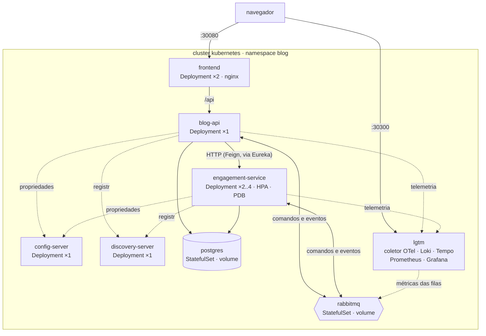
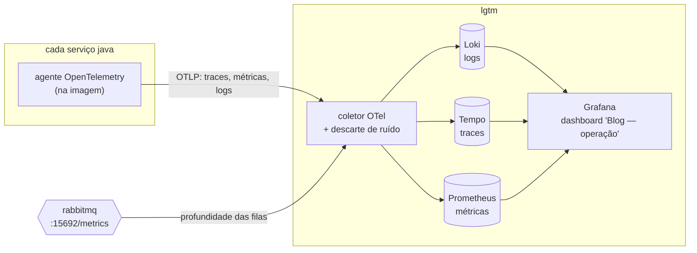
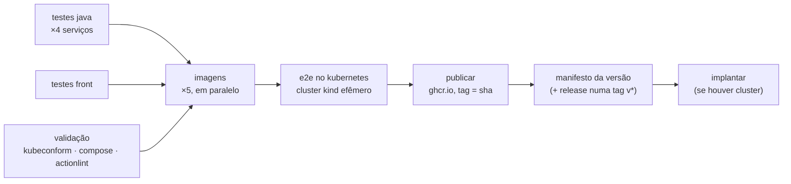

# implantação e operação

este documento detalha a quinta entrega: preparar o blog para rodar em produção — contêineres, orquestração com Kubernetes, monitoramento, gestão de configuração e versões, CI/CD e testes que cobrem o sistema inteiro. a arquitetura continua em [ARQUITETURA.md](ARQUITETURA.md), a persistência em [PERSISTENCIA.md](PERSISTENCIA.md), o microsserviço em [MICROSSERVICO.md](MICROSSERVICO.md) e a mensageria em [EVENTOS.md](EVENTOS.md). o que segue é o recorte da operação.

até a quarta entrega, o sistema rodava na máquina de quem desenvolve: cinco processos pelo `./mvnw`, um H2 em memória por serviço e o RabbitMQ num contêiner. isso bastava para mostrar a arquitetura, e não sobreviveria a um dia em produção — o banco zera a cada restart, duas réplicas teriam dois bancos, ninguém saberia o que aconteceu quando algo falhasse, e colocar uma versão nova no ar seria um procedimento manual. a quinta entrega resolve cada um desses pontos, e **nada aqui é teórico**: tudo foi implantado num cluster Kubernetes local, derrubado, atualizado e posto sob carga, e os números abaixo são os medidos.

## o resumo

| o enunciado pede | o que foi feito | onde |
| --- | --- | --- |
| Docker para os microsserviços | uma imagem por serviço (multi-stage, JRE Alpine, sem root, agente de observabilidade) e um compose com o ambiente de produção simulado | `*/Dockerfile`, [docker-compose.yml](../docker-compose.yml) |
| Kubernetes para implantação e escala | manifestos com kustomize: StatefulSets para os dados, sondas, rollout sem queda, HPA de 2 a 4 réplicas, PDB | [deploy/](../deploy/) |
| agregação de logs e rastreamento | OpenTelemetry nas imagens; Loki (logs), Tempo (traces), Prometheus (métricas) e Grafana com dashboard próprio | [deploy/otel/](../deploy/otel/), [deploy/grafana/](../deploy/grafana/) |
| Git e GitHub para versões | commits convencionais, tags por entrega, changelog, template de PR, dependabot; configuração versionada no config server | [CHANGELOG.md](../CHANGELOG.md), [.github/](../.github/) |
| CI/CD com GitHub Actions | testes → validação → imagens → e2e num Kubernetes efêmero → publicação no GHCR → manifesto versionado → implantação | [.github/workflows/pipeline.yml](../.github/workflows/pipeline.yml) |
| testes abrangentes | 153 testes automatizados, e2e contra a stack implantada, teste de carga, validação de manifestos | seção [testes](#testes) |

## a topologia de produção

o ambiente de produção simulado é o mesmo em dois lugares: no `docker compose --profile completo` e num cluster Kubernetes (kind). os nomes dos serviços são idênticos nos dois — é o que permite um único arquivo de configuração servir ambos.



o navegador alcança **uma** porta da aplicação: o nginx do front, que serve os arquivos estáticos e repassa `/api` ao monólito. é a mesma decisão da terceira entrega — uma origem só —, agora sem nem precisar de CORS.

## os contêineres

cada serviço Java tem o seu `Dockerfile`, no próprio diretório, com o mesmo molde:

```dockerfile
FROM eclipse-temurin:21-jdk AS build        # compila com o wrapper do próprio projeto
...
RUN ./mvnw -B -q -DskipTests package \
 && java -Djarmode=tools -jar app.jar extract --layers --launcher --destination extraido

FROM eclipse-temurin:21-jre-alpine            # só o JRE: sem compilador, sem código-fonte
ADD --checksum=sha256:1b0246d3... .../opentelemetry-javaagent-2.16.0.jar /opt/otel/...
RUN addgroup -S -g 10001 app && adduser -S -u 10001 -G app app
COPY --from=build /build/extraido/dependencies/ ./          # camadas, da que muda menos
COPY --from=build /build/extraido/spring-boot-loader/ ./    # para a que muda mais
COPY --from=build /build/extraido/snapshot-dependencies/ ./
COPY --from=build /build/extraido/application/ ./
USER 10001
ENV JAVA_TOOL_OPTIONS="-XX:MaxRAMPercentage=75 -javaagent:/opt/otel/opentelemetry-javaagent.jar"
```

as decisões que valem registro:

- **o jar é compilado dentro do build.** a imagem não depende de nada instalado em quem a constrói, e sai igual na máquina e no pipeline. os testes não rodam aqui: rodam antes, no pipeline, com relatório próprio.
- **camadas do Spring Boot.** as dependências (a maior parte do tamanho) ficam numa camada que só muda quando o `pom.xml` muda. trocar uma linha de código invalida só a última camada, e o registro e os nós do cluster reaproveitam o resto.
- **usuário sem root, com UID numérico.** o primeiro deploy no Kubernetes falhou exatamente aqui: com `runAsNonRoot: true`, o kubelet só aceita a imagem se conseguir verificar que o usuário não é o 0, e um `USER app` por nome ele não verifica (`container has runAsNonRoot and image has non-numeric user`). virou `USER 10001`.
- **`MaxRAMPercentage=75`.** a JVM dimensiona o heap pelo limite de memória do contêiner, e não pela memória da máquina. sem isso, um limite de 640Mi no Kubernetes e uma JVM que acha que tem 8Gi terminam em `OOMKilled`.
- **o agente OpenTelemetry, com versão e checksum fixos.** instrumenta HTTP, Feign, JDBC, RabbitMQ e o logback sem uma linha de código (seção [monitoramento](#monitoramento)). `OTEL_JAVAAGENT_ENABLED=false` o desliga sem trocar de imagem.

o front é construído pelo Vite e servido por um nginx sem root (`nginx-unprivileged`). a URL da API deixou de ser `http://localhost:8080` embutida no build e passou a ser relativa (`/api`): em desenvolvimento, o Vite repassa ao monólito; no contêiner, o nginx. **a mesma construção do front serve em qualquer endereço.**

| imagem | tamanho |
| --- | --- |
| `blog/config-server` | 452 MB |
| `blog/discovery-server` | 479 MB |
| `blog/engagement-service` | 528 MB |
| `blog/blog-api` | 531 MB |
| `blog/frontend` | 76 MB |

## a configuração por ambiente

o sistema tem dois ambientes — desenvolvimento (`./subir.sh`, H2, `localhost`) e contêiner (compose e Kubernetes, PostgreSQL, nomes de serviço) —, e a diferença entre eles virou um **perfil do config server**: `container`. é o uso para o qual os perfis do Spring Cloud Config existem: o mesmo jar, e só o ambiente muda.

o critério é o mesmo da terceira entrega, e ele decidiu onde cada coisa foi parar:

| o quê | onde | por quê |
| --- | --- | --- |
| endereço do Eureka, do broker, do banco; credenciais | config server, `application-container.yml` e `<serviço>-container.yml` | é ambiente |
| schema vem das migrações (`ddl-auto: validate`, Flyway ligado) | `application.yml` do serviço, perfil `container` | é decisão de como o código se comporta em produção |
| sondas de liveness e readiness, id do trace no log | `application.yml` do serviço, perfil `container` | idem |
| seeder desligado no engajamento | `application.yml` do engajamento, perfil `container` | duas réplicas subindo juntas veriam o banco vazio e semeariam em dobro |

**as senhas nunca passam pelo config server.** antes de depender disso, foi verificado que o config server entrega os placeholders como texto:

```bash
curl -s localhost:8888/blog-api/container | jq '.propertySources[] | .source["spring.rabbitmq.password"]'
# "${RABBITMQ_PASSWORD:guest}"      <- quem resolve é o pod, com a variável de ambiente dele
```

no Kubernetes, essa variável vem de um `Secret`. os valores do `k8s/01-segredos.yaml` são os do ambiente de demonstração e estão versionados só por isso; num cluster de verdade, o Secret viria de um cofre (external-secrets, sealed-secrets, o gerenciador do provedor).

**uma armadilha do Kubernetes que custou o segundo deploy.** o Kubernetes injeta em todo pod variáveis de ambiente para cada Service do namespace — e para o Service `rabbitmq`, uma delas é `RABBITMQ_PORT=tcp://10.96.193.15:5672`. o placeholder `${RABBITMQ_PORT:5672}` do config server pegou esse valor, e os serviços morreram no startup com `NumberFormatException: For input string: "tcp://10.96.193.15:5672"`. o próprio pod do RabbitMQ, cuja imagem lê variáveis `RABBITMQ_*`, reiniciou uma vez pelo mesmo motivo. a descoberta aqui é por DNS, então todos os pods têm `enableServiceLinks: false`.

## o banco de produção

o H2 em memória continua sendo o banco de desenvolvimento e dos testes. em contêiner, é **PostgreSQL 16**: um servidor, dois bancos (`blogdb`, `engagementdb`) e dois usuários — o usuário `blog` não tem acesso ao banco do engajamento, e vice-versa. é o "um banco por serviço" da terceira entrega mantido sem pagar por duas instâncias. o script de criação ([deploy/postgres/01-bancos.sh](../deploy/postgres/01-bancos.sh)) é o mesmo no compose e no Kubernetes.

o schema vem de **migrações Flyway** (`src/main/resources/db/migration/V1__schema_inicial.sql` em cada serviço), e o Hibernate só confere se o mapeamento bate (`ddl-auto: validate`). gerar o schema a partir das entidades é conveniente em desenvolvimento e perigoso em produção: uma mudança de entidade viraria, sem revisão, um `alter table` no banco de verdade. a V1 não foi escrita do zero: foi gerada pelo próprio Hibernate contra um PostgreSQL (schema-generation), e revisada. daqui para frente, mudança de schema é uma V2, nunca uma edição da V1 — o Flyway guarda o checksum e recusa a migração que mudou.

com duas réplicas do engajamento subindo ao mesmo tempo, as duas tentam migrar. o Flyway trava a tabela de histórico durante a migração, e o log mostra o que se espera: uma réplica aplica, a outra encontra pronto.

```
engagement-service-1  | Migrating schema "public" to version "1 - schema inicial"
engagement-service-1  | Successfully applied 1 migration to schema "public", now at version v1
engagement-service-2  | Schema "public" is up to date. No migration necessary.
```

### o defeito que o PostgreSQL revelou

gerar o schema para o PostgreSQL mostrou duas coisas que o H2 escondia desde a segunda entrega. o texto de posts e comentários era `@Lob`, e:

1. no PostgreSQL, `@Lob String` vira `oid` — um *large object*, guardado fora da linha, que fica órfão quando a linha é apagada e exige transação para ser lido;
2. **pior: o Envers não levava o `@Lob` para a tabela de auditoria**, que nascia `content varchar(255)`. qualquer post ou comentário com mais de 255 caracteres quebrava a gravação — no H2 também.

um teste provou o defeito antes da correção (`Value too long for column "CONTENT CHARACTER VARYING(255)"`). o `@Lob` virou `@JdbcTypeCode(SqlTypes.LONG32VARCHAR)`, que é `text` no PostgreSQL, nas duas tabelas. os testes `postComTextoLongo_temHistoricoComOTextoInteiro` e `comentarioLongo_eGravadoEAuditadoInteiro` ficaram como regressão, e o e2e cria um post de 2.000 caracteres a cada execução.

## o Kubernetes

a implantação está em [deploy/](../deploy/), montada com kustomize (`kubectl apply -k deploy/`). o kustomize fica na raiz de `deploy/`, e não em `deploy/k8s/`, porque os arquivos compartilhados com o compose — o script do PostgreSQL, a configuração do coletor, o dashboard — viram ConfigMaps gerados a partir da mesma fonte. um arquivo, dois ambientes.

| recurso | tipo | réplicas | por quê |
| --- | --- | --- | --- |
| `postgres` | StatefulSet + volume | 1 | identidade estável e disco que acompanha o pod |
| `rabbitmq` | StatefulSet + volume | 1 | filas duráveis só são duráveis se o disco sobreviver; o nome do nó depende do hostname |
| `lgtm` | Deployment | 1 | a stack de observabilidade (seção seguinte) |
| `config-server`, `discovery-server` | Deployment | 1 | infraestrutura |
| `engagement-service` | Deployment + HPA + PDB | 2 a 4 | o serviço que escala |
| `blog-api` | Deployment | 1 | o relay do outbox de duas instâncias publicaria em dobro (ver [o que ficou de fora](#o-que-ficou-de-fora)) |
| `frontend` | Deployment | 2 | stateless |

### as sondas

cada serviço Java tem três, e cada uma responde uma pergunta diferente:

- **startup** (`/actuator/health/liveness`, até 3 min): a JVM com o agente leva de 20 a 40 segundos para subir. enquanto a startup não passa, as outras sondas não rodam, e o pod não é morto por estar "lento".
- **liveness** (`/actuator/health/liveness`): o processo travou? o Kubernetes reinicia o contêiner.
- **readiness** (`/actuator/health/readiness`): pode receber tráfego? se não, sai do Service até voltar.

os recursos pedem CPU (a base do HPA e da distribuição pelos nós) e limitam memória (o que a JVM usa para o heap). **não há limite de CPU**, de propósito: limitar CPU de JVM causa *throttling* em rajadas, como a do próprio startup.

### atualizar sem derrubar nada

o teste: um loop fazendo leituras de conversa — que dependem do engajamento — a cada 200 ms, enquanto `kubectl rollout restart deployment/engagement-service` troca as duas réplicas.

| tentativa | respostas | erros |
| --- | --- | --- |
| rolling update padrão | 508 | **140 (28%)** |
| + caches de descoberta curtos e `preStop` que marca a réplica DOWN | 704 | 3 (0,4%) |
| + `minReadySeconds: 20` | 848 | **0** |

o primeiro número surpreendeu, e a causa é a descoberta de serviços. o monólito acha o engajamento pelo Eureka, e há três caches entre uma réplica morrer e o monólito parar de chamá-la: o servidor Eureka responde de um cache de 30s, o cliente busca o registro a cada 10s, e o load balancer do Spring Cloud guarda a lista de instâncias por 35s. o monólito continuava chamando pods já encerrados — e o circuit breaker, vendo metade das chamadas falhar, abria e derrubava também as que iriam para a réplica boa.

a correção tem três partes:

1. **a réplica que vai sair avisa antes.** o `preStop` marca a instância como `DOWN` no Eureka (`POST /actuator/serviceregistry`) e espera 20 segundos **ainda atendendo**, para as chamadas que chegarem nesse intervalo. só então o Kubernetes manda o `SIGTERM`, e o Spring encerra com graça.
2. **os caches ficaram curtos:** 3s no servidor Eureka, 5s na busca do cliente, 5s no load balancer.
3. **`minReadySeconds: 20`.** os 3 erros restantes tinham outra causa: o Kubernetes considerava o pod novo disponível no instante em que ele ficava pronto, e já encerrava o próximo antigo — antes de o monólito enxergar o novo na tabela. por um instante, não havia instância visível nenhuma (`No servers available for service: engagement-service`). com o prazo, o rollout espera o pod novo aparecer na descoberta antes de seguir.

### escalar sob carga

o engajamento tem um `HorizontalPodAutoscaler`: de 2 a 4 réplicas, alvo de 70% da CPU pedida. o teste de carga ([scripts/carga.js](../scripts/carga.js), k6, dentro do cluster) simula 40 leitores por 2 minutos: estante, conversa, reações e, um em cada dez, um comentário pela fila.

```
19:03:09  cpu media    7% do request   replicas desejadas 2   prontas 2
19:03:24  cpu media  168% do request   replicas desejadas 2   prontas 2
19:03:54  cpu media  143% do request   replicas desejadas 4   prontas 3
19:04:09  cpu media  119% do request   replicas desejadas 4   prontas 4

   ✓ checks.........................: 100.00% 48174 out of 48174
   ✓ http_req_duration..............: avg=2.92ms  p(95)=6.94ms
   ✓ http_req_failed................: 0.00%   0 out of 48175
     http_reqs......................: 48175   267/s
```

as réplicas subiram de 2 para 4 em cerca de 30 segundos, e **nenhuma das 48.175 requisições falhou** — inclusive durante a entrada das réplicas novas, que o monólito passou a usar assim que apareceram no registro.

a primeira versão do HPA tinha um defeito que só apareceu observando: ao fim de uma rajada, ele descia para 2 réplicas e, 15 segundos depois, subia de novo para 4. o metrics-server ainda trazia a CPU do período de carga, agora dividida por dois pods, e o HPA lia isso como carga nova. uma janela de estabilização na subida (45s) resolveu: a recomendação de escalar precisa se sustentar antes de valer.

o `PodDisruptionBudget` completa o quadro: numa manutenção do nó (`kubectl drain`), o Kubernetes nunca derruba as duas réplicas ao mesmo tempo.

### o broker cai

com o RabbitMQ fora (`kubectl -n blog scale statefulset/rabbitmq --replicas=0`), o comportamento esperado da quarta entrega se manteve em quase tudo: ler a conversa continuou respondendo, o comentário respondeu 503 na hora (o texto fica no formulário), e a exclusão de um post ficou guardada no outbox — `pendingEvents: 1` no diagnóstico — até o broker voltar e o relay publicá-la.

o que não se manteve foi a reação: **503 depois de 3,9 segundos, com a reação já gravada no banco**. o leitor via erro de uma operação que deu certo, tentava de novo e levava 409. a causa estava no evento de melhor esforço que o engajamento publica depois do commit (`reaction.added`): ele era publicado na thread da requisição. em desenvolvimento, com o broker fora, a conexão era recusada na hora; no Kubernetes, o Service do RabbitMQ continua existindo sem pods, a conexão espera o timeout (2s), e o monólito desiste em 3s. a publicação passou a sair de um executor próprio (`@Async`), com fila limitada — cheia, descarta com aviso, porque o que ela carrega é um contador que a próxima mudança corrige. repetido o teste: reações com 201 em 20 a 350 ms, com o broker fora. um teste de unidade (`brokerLento_naoAtrasaAResposta`) segura a regressão.

### autorrecuperação

um pod do engajamento morto à força, sem `preStop` — como um processo que cai —, no meio de um loop de leituras: **344 de 344 respostas 200**. o retry do load balancer para a próxima instância cobriu a chamada que caiu no pod morto, e o Kubernetes recriou o pod em seguida.

### o Eureka no Kubernetes

o registro é, a rigor, redundante num cluster: o Kubernetes já tem descoberta (Services e DNS). ele ficou porque é parte da arquitetura da terceira entrega e porque continua sendo o que permite ao monólito balancear entre as réplicas do engajamento com o circuit breaker que ele já tinha. o preço apareceu no rollout: dois sistemas de descoberta, cada um com os seus caches. a troca natural é o **Spring Cloud Kubernetes**, que lê os Endpoints do cluster no lugar do Eureka — o `@FeignClient(name = "engagement-service")` não mudaria, porque o nome lógico é o mesmo nome do Service.

## monitoramento



a stack é a **Grafana LGTM** (Loki, Grafana, Tempo, Mimir/Prometheus) com um coletor OpenTelemetry na frente, empacotada na imagem `grafana/otel-lgtm`. num ambiente simulado, um contêiner com tudo basta; em produção cada peça seria um serviço próprio com armazenamento de objetos, ou um serviço gerenciado.

a instrumentação é o **agente Java do OpenTelemetry**, carregado pela imagem. ele instrumenta sem código — requisições HTTP, chamadas Feign, consultas JDBC, publicação e consumo no RabbitMQ, e o logback — e manda tudo por OTLP ao coletor.

### rastreamento de transações

o contexto do trace viaja nos cabeçalhos HTTP e nos cabeçalhos das mensagens AMQP, então **um trace atravessa a fila**. o de enviar um comentário, como o Tempo o mostra:

```
blog-api            SERVER     POST /api/posts/{postId}/comments
blog-api            PRODUCER   blog.commands publish
blog-api            CLIENT     Channel.waitForConfirmsOrDie
engagement-service  CONSUMER   engagement.comment-commands process
engagement-service  CLIENT     INSERT engagementdb.comments
engagement-service  CLIENT     INSERT engagementdb.comments_aud
engagement-service  PRODUCER   blog.engagement publish           (comment.added)
blog-api            CONSUMER   blog-api.engagement-snapshots process
blog-api            CLIENT     INSERT blogdb.engagement_counters
```

a volta inteira — a requisição, o comando, o consumidor do outro lado, a auditoria, o evento de volta e a atualização do contador — num trace só.

**o outbox quebrava o trace, e isso foi corrigido.** o relay publica de uma thread agendada, segundos depois do commit, sem trace nenhum: "apagar um post" e "limpar a conversa no outro serviço" apareciam como dois traces sem relação. agora o `OutboxWriter` guarda o `traceparent` (W3C) na linha do outbox, e o `OutboxRelay` publica **dentro** desse contexto. o trace da exclusão passou a ser um só: o `DELETE`, a publicação do relay (com o intervalo do outbox visível entre os dois), a limpeza no engajamento e o `engagement.purged` voltando ao monólito. usa só a API do OpenTelemetry — sem o agente, em desenvolvimento, ela é um no-op.

### logs agregados e correlacionados

o agente manda os logs ao Loki com o `trace_id` de cada linha, e o perfil `container` também o coloca na saída do console:

```
INFO [851757a6d76f4b244b9db01e24280d1f,a385d1cba08e256b] ... CommentCommandListener : comentario 1 registrado no post 1
```

é isso que liga as três fontes. de uma linha de log no Grafana, chega-se ao trace completo no Tempo; de um trace, aos logs dele — dos dois serviços. o monólito passou a registrar o envio do comando (`comentario aceito no post 1 e enviado a fila`), para que o trace de um comentário tenha log dos dois lados.

### métricas

o agente exporta as métricas de HTTP (servidor e cliente), JVM e pool de conexões. duas vieram de fora dele, porque são as que importam para operar uma arquitetura orientada a eventos:

- **a profundidade de cada fila**, lida pelo coletor do plugin Prometheus do RabbitMQ (ligado por padrão na imagem, porta 15692). uma fila que só cresce é um consumidor parado; uma `.dlq` com mensagens pede alguém olhando.
- **os eventos pendentes no outbox** (`blog.outbox.pending`), um gauge do monólito. zero é o normal; um número que só cresce é o broker fora do ar, com os eventos guardados em segurança esperando por ele.

### o dashboard

"Blog — operação" ([deploy/grafana/dashboards/blog-operacao.json](../deploy/grafana/dashboards/blog-operacao.json)) é provisionado junto da stack, no compose e no Kubernetes, ao lado dos dashboards de métricas RED e de JVM que a imagem já traz. ele tem cinco blocos:

- **saúde**: instâncias por serviço, eventos esperando no outbox, mensagens nas dead letters;
- **HTTP**: requisições por rota, latência p95, respostas por status (o 202 do comentário, o 503 de uma peça fora) e as chamadas do monólito a cada instância do engajamento;
- **mensageria**: mensagens prontas por fila e dead letters por fila;
- **JVM e banco**: heap por instância e conexões em uso;
- **logs e traces**: avisos e erros de todos os serviços (cada linha abre o trace dela) e os traces recentes que passam pelo engajamento.

um filtro de ambiente separa o compose do Kubernetes, e o nome do pod vai como atributo em toda telemetria — é o que distingue as réplicas.

### o ruído, e onde ele foi filtrado

com a stack no ar, os traces úteis sumiam. o agente instrumenta tudo, e parte do que ele registra é manutenção: o relay do outbox varre a tabela a cada 2s, as sondas de saúde batem a cada 10s, cada serviço renova o registro no Eureka a cada 10s. cada uma dessas vira um trace, e "apagar um post" ficava enterrado entre centenas de `OutboxRelayScheduler.relay`.

o filtro está no **coletor** ([deploy/otel/otelcol-config.yaml](../deploy/otel/otelcol-config.yaml)), e não na aplicação: ninguém sabe de antemão qual chamada vai precisar ser investigada, então a aplicação registra tudo, e quem decide o que guardar é a infraestrutura de observabilidade. é *tail sampling*: a decisão olha o trace inteiro, e descarta só os que **começam** numa tarefa de manutenção — condicionar na raiz é o que impede de perder, por exemplo, um trace de leitura de conversa, que tem uma chamada `GET` do Feign como filha. medido: em 65 segundos de tráfego, chegaram ao Tempo exatamente os 6 traces das requisições feitas, contra dezenas de traces de manutenção antes do filtro.

## gestão de configuração e versões

**o código.** o repositório segue um fluxo simples, adequado a um projeto com um desenvolvedor e um pipeline que valida tudo:

- a `main` é sempre implantável — o que entra nela passou pelo pipeline inteiro, incluindo o e2e num Kubernetes;
- mudanças entram por branch e pull request, com o template em [.github/pull_request_template.md](../.github/pull_request_template.md) (o que muda, como foi verificado, migração nova em vez de edição, changelog);
- os commits seguem o [Conventional Commits](https://www.conventionalcommits.org/pt-br/v1.0.0/) (`feat:`, `fix:`, `docs:`, `chore:`), e o corpo explica o porquê — o histórico do projeto é lido como documentação;
- cada entrega é uma versão, com tag (`v5.0.0`) e entrada no [CHANGELOG.md](../CHANGELOG.md). uma tag `v*` dispara a release no GitHub, com o manifesto daquela versão anexado;
- o **Dependabot** ([.github/dependabot.yml](../.github/dependabot.yml)) abre pull requests semanais com dependências novas — Maven, npm, imagens base e as próprias actions —, e cada um passa pelo pipeline antes de alguém decidir se entra.

**a configuração.** as propriedades de ambiente vivem no config server e estão no repositório, versionadas junto do código: mudar um timeout é um commit, revisado e com histórico. o backend `native` foi escolhido na terceira entrega para não exigir um segundo repositório; a troca para o backend Git — que é o que se usa em produção — é mudar o perfil e apontar `spring.cloud.config.server.git.uri`. a infraestrutura também é código: Dockerfiles, compose, manifestos e o pipeline estão todos versionados, e nenhum recurso do cluster é criado à mão.

## CI/CD



o pipeline ([.github/workflows/pipeline.yml](../.github/workflows/pipeline.yml)) roda a cada push e pull request, e cada camada só roda se a anterior passou:

| job | o que garante |
| --- | --- |
| **testes (×4)** | `./mvnw verify` em cada serviço, em paralelo: unidade, integração com RabbitMQ real (Testcontainers — o runner tem Docker) e cobertura JaCoCo, com o resumo no painel da execução e os relatórios como artefato |
| **testes (frontend)** | Vitest e o build de produção |
| **validação** | os manifestos renderizados pelo kustomize contra o schema da API do Kubernetes 1.33 (kubeconform), o compose e o próprio workflow (actionlint) — o que não é código mas quebra a implantação |
| **imagens (×5)** | cada imagem construída uma vez, com cache de camadas entre execuções, e passada adiante como artefato — **a imagem testada é a que segue** |
| **e2e no kubernetes** | um cluster kind criado do zero, a mesma implantação da demonstração (`scripts/k8s-subir.sh`) e o teste de ponta a ponta contra ela, inclusive traces e logs chegando ao Grafana. se falhar, o job despeja pods, eventos e logs |
| **publicar (×5)** | só em push na `main` ou numa tag: as imagens vão para o GitHub Container Registry, marcadas com o sha do commit (e `latest`, e a versão numa tag) |
| **manifesto da versão** | o manifesto do Kubernetes com as imagens trocadas pelas do registro e **fixadas no sha** — é o que se aplicaria num cluster de verdade. vira artefato, e numa tag vai anexado à release |
| **implantar** | aplica esse manifesto num cluster real, se o secret `KUBECONFIG_B64` existir; o ambiente `producao` do GitHub pode exigir aprovação manual antes. sem o secret, o job avisa e termina: o ambiente de produção simulado é o do e2e |

a ordem é o ponto: **o que chega ao registro já subiu num Kubernetes e passou pelo e2e**. e o que se implanta é uma versão exata — o manifesto aponta o sha, nunca "a última".

## testes

| camada | o quê | quantos |
| --- | --- | --- |
| unidade e integração (Java) | serviços, repositórios, APIs, auditoria, mensageria com RabbitMQ real | 138 (config 5, discovery 1, monólito 76, engajamento 56) |
| componentes (front) | cliente da API, estante com contadores, recado "na fila", selos | 15 |
| ponta a ponta | a stack implantada, pela porta pública: autores, posts, comentário pela fila, reação, contadores por evento, exclusão pelo outbox, texto longo, e a observabilidade (log no Loki e trace atravessando os dois serviços no Tempo) | 16 verificações, no compose, no kind e no pipeline |
| carga | 40 leitores por 2 minutos, com limites de erro (<1%) e latência (p95 < 1s) | 48.175 requisições, 0 falhas |
| infraestrutura | manifestos contra o schema, compose, workflow | a cada push |

cobertura de linhas: 86,6% no monólito e 93,1% no microsserviço (desvios: 73% e 75%). os dois serviços de infraestrutura ficam em 33% porque o único código deles é a classe `main`, que os testes não executam — o que eles testam é a configuração que servem.

o e2e ([scripts/e2e.sh](../scripts/e2e.sh)) é o mesmo script em todo lugar, e é o que prova o conjunto: o nginx repassando ao monólito, o monólito achando o engajamento pelo Eureka, o comentário atravessando a fila, o evento de post apagado saindo pelo outbox e voltando como contador zerado, o PostgreSQL guardando tudo. o que é assíncrono é verificado por espera, com limite: o script repete a consulta até a condição valer, em vez de dormir um tempo fixo e torcer.

os testes do front cobrem o que a quarta entrega mudou na tela: o recado aparece "na fila" e vira comentário quando o engajamento o grava (com o tempo simulado, sem esperar de verdade); o formulário continua com o engajamento fora; se o envio falhar, o texto continua no formulário.

## demonstração

### no docker compose

```bash
docker compose --profile completo up -d --build --wait
```

sobe os nove contêineres e espera cada um ficar saudável. a interface fica em `http://localhost:8080`, o Grafana em `http://localhost:3000` (admin / admin), o painel do RabbitMQ em `http://localhost:15672` e o do Eureka em `http://localhost:8761` — com o engagement-service registrado duas vezes.

```bash
GRAFANA_URL=http://localhost:3000 scripts/e2e.sh
```

para derrubar: `docker compose --profile completo down` (os volumes ficam; `down -v` apaga).

### no Kubernetes

```bash
scripts/k8s-subir.sh
```

cria o cluster kind (se não existir), constrói as imagens, carrega no cluster, instala o metrics-server e implanta, esperando cada peça ficar pronta na ordem das dependências. de um cluster vazio ao sistema no ar: cerca de 2 minutos (com as imagens já construídas), sem nenhum pod reiniciando — os serviços esperam o banco e o broker num `initContainer`, visível como `Init:0/1`. a interface fica em `http://localhost:30080`, o Grafana em `http://localhost:30300`, o painel do RabbitMQ em `http://localhost:31567` (blog / rabbit-demo) e o do Eureka em `http://localhost:30761`.

**1. o que está no ar**

```bash
kubectl -n blog get pods,svc,hpa,pdb
```

**2. o sistema inteiro funciona**

```bash
GRAFANA_URL=http://localhost:30300 scripts/e2e.sh http://localhost:30080
```

**3. um trace atravessando a fila**

comente num post pela interface. no Grafana, *Explore → Tempo*, busque `{ resource.service.name = "engagement-service" }`: o trace do comentário mostra o `POST` no monólito, a publicação, o consumidor no engajamento e o evento voltando. clique em "logs for this span" e o Loki mostra as linhas dos dois serviços com aquele `trace_id`.

**4. atualizar sem derrubar**

num terminal, um loop de leituras:

```bash
while true; do curl -s -o /dev/null -w '%{http_code}\n' localhost:30080/api/posts/1/comments; sleep 0.2; done
```

em outro, `kubectl -n blog rollout restart deployment/engagement-service`. o loop só imprime 200, e o painel do Eureka mostra as instâncias trocando.

**5. escalar sob carga**

```bash
scripts/k8s-carga.sh
```

roda o k6 dentro do cluster e mostra, a cada 15s, o que o HPA está vendo: a CPU passa do alvo e as réplicas sobem de 2 para 4. no dashboard, o painel de instâncias mostra o engajamento com 4, e as chamadas do monólito se distribuem entre elas. alguns minutos depois de a carga acabar, o HPA volta para 2.

**6. um pod morre**

```bash
kubectl -n blog delete --grace-period=0 --force \
  "$(kubectl -n blog get pods -l app.kubernetes.io/name=engagement-service -o name | head -1)"
```

o Deployment recria o pod; as leituras continuam respondendo.

**7. o broker cai**

```bash
kubectl -n blog scale statefulset/rabbitmq --replicas=0
```

apague um post pela interface. no dashboard, "eventos esperando no outbox" vai para 1 e fica. ler a conversa e reagir continuam funcionando (HTTP); comentar responde 503 e o texto fica no formulário. `kubectl -n blog scale statefulset/rabbitmq --replicas=1`: o relay publica o que ficou, o contador volta a zero, e as filas aparecem de novo no painel — o volume guardou tudo.

para derrubar: `scripts/k8s-derrubar.sh`.

## os defeitos que só a implantação revelou

os testes automatizados passavam antes de tudo isto. implantar, derrubar peças, atualizar e pôr carga revelou onze problemas que nenhum deles pegava — e é esse, mais do que qualquer outro, o argumento para o job de e2e no Kubernetes existir no pipeline:

| onde apareceu | o defeito | a correção |
| --- | --- | --- |
| schema do PostgreSQL | texto acima de 255 caracteres quebrava a auditoria (desde a segunda entrega) | `LONG32VARCHAR` no lugar de `@Lob`, e testes de regressão |
| primeiro deploy | `runAsNonRoot` recusa usuário por nome | UID numérico na imagem |
| segundo deploy | variáveis de Service do Kubernetes colidiam com as do config server | `enableServiceLinks: false` |
| implantação do zero | os serviços subiam antes do PostgreSQL, o Flyway falhava e o pod reiniciava até dar certo (2 reinícios por pod) | `initContainer` que espera o banco e o broker |
| primeira subida do broker | a sonda, como root, criava o `.erlang.cookie` antes do servidor, que morria sem conseguir lê-lo — no compose e no Kubernetes | o contêiner inteiro como o usuário `rabbitmq` (999) |
| healthcheck do front | `localhost` resolvia para IPv6 e o nginx só escutava IPv4 | `listen [::]:8080` |
| rollout do engajamento | 28% de 503 pelos caches de descoberta | `preStop` com DOWN no Eureka, caches curtos, `minReadySeconds` |
| HPA | subia e descia em 15s ao fim de uma rajada | janela de estabilização na subida |
| broker fora | reação gravada e respondida com 503 em 3,9s | publicação assíncrona com fila limitada |
| traces | o outbox partia o trace da exclusão em dois | `traceparent` guardado na linha e restaurado na publicação |
| traces | a manutenção enterrava os traces úteis | tail sampling no coletor, pela raiz do trace |

## o que ficou de fora

- **escalar o monólito.** o relay do outbox de duas instâncias leria as mesmas linhas pendentes e publicaria em dobro. os consumidores toleram (são idempotentes), mas o certo é travar as linhas na leitura — `SELECT ... FOR UPDATE SKIP LOCKED`, agora possível com o PostgreSQL — ou eleger um relay só. por isso o `blog-api` tem uma réplica.
- **Spring Cloud Kubernetes no lugar do Eureka.** eliminaria o segundo sistema de descoberta e os caches que custaram o rollout (seção [o Eureka no Kubernetes](#o-eureka-no-kubernetes)).
- **Ingress ou Gateway com TLS.** a entrada é por NodePort, suficiente num cluster local; em produção, um Gateway (a API que sucede o Ingress) com domínio e certificado.
- **banco e broker gerenciados, com réplica e backup.** um PostgreSQL e um RabbitMQ de uma instância cada, em StatefulSet. em produção: um banco gerenciado (ou o operador CloudNativePG) e o RabbitMQ Cluster Operator com três nós e filas quorum.
- **observabilidade com armazenamento persistente e alertas.** a stack LGTM guarda os dados num `emptyDir` no Kubernetes (num volume, no compose). os alertas óbvios — outbox que só cresce, dead letter com mensagem, fila acumulando, taxa de 5xx — estão desenhados no dashboard e não configurados como regra.
- **segredos de verdade.** os Secrets do Kubernetes estão versionados com valores de demonstração; em produção, viriam de um cofre.
- **implantação contínua ligada.** o job existe e está condicionado ao secret do cluster; sem um cluster público, a entrega termina na imagem publicada e no manifesto versionado.
- **imagens multi-arquitetura.** o pipeline constrói para amd64 (a arquitetura dos runners); a máquina de desenvolvimento, arm64, constrói a sua localmente.
