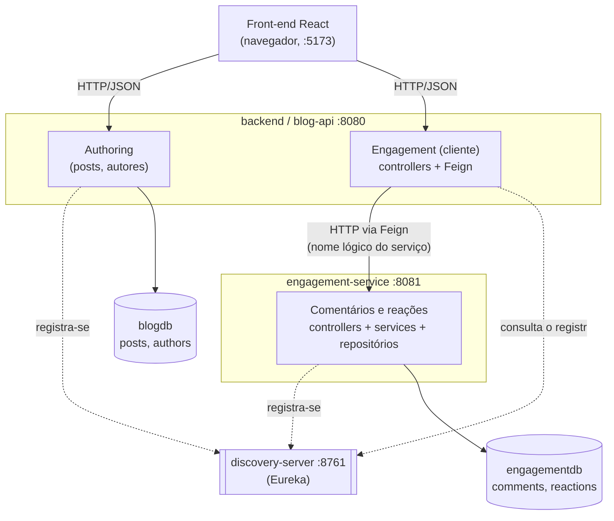
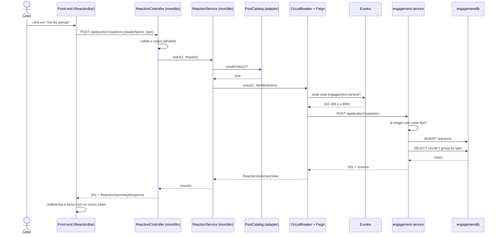
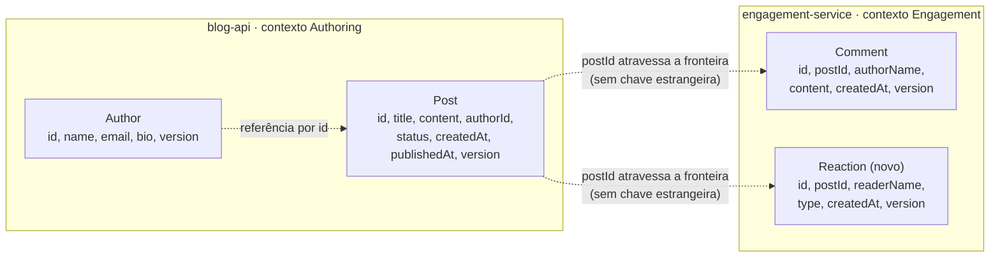

# o microsserviço de engajamento

este documento detalha a terceira entrega: a extração de um microsserviço a partir do monólito, a comunicação distribuída entre os dois e a capacidade nova que nasceu do outro lado da fronteira. a arquitetura geral continua descrita em [ARQUITETURA.md](ARQUITETURA.md) e a camada de persistência em [PERSISTENCIA.md](PERSISTENCIA.md); o que segue é o recorte do sistema distribuído.

## a decisão de partida

a primeira entrega já registrou, sobre a ponte entre os dois bounded contexts, que "se um dia esses contextos virarem serviços separados, esse adaptador é o ponto que vira uma chamada de rede". esta entrega cobra essa promessa.

o candidato à extração não foi escolhido por ser conveniente, e sim porque o desenho já apontava para ele. o contexto de **engagement** era o único que:

- não compartilhava entidade nenhuma com o resto do sistema (comentário referenciava post por id, sem `@ManyToOne` nem chave estrangeira);
- só dependia do outro contexto através de uma interface declarada por ele mesmo, a `PostCatalog`;
- tinha um ciclo de vida de negócio próprio — conversa e reação mudam muito mais rápido do que a estrutura de posts e autores.

os três pontos são o retrato de um acoplamento baixo. onde há uma dependência dessas, mover o código de processo é uma cirurgia pequena; onde há entidades entrelaçadas por chave estrangeira, seria uma reescrita.

além de mudar de processo, o engajamento ganhou uma capacidade que ele não tinha: **reações**. era o teste que faltava. mover código existente prova que a fronteira estava no lugar; desenvolver algo novo do outro lado prova que o serviço é autônomo de verdade — a reação nasceu, cresceu e é validada inteiramente dentro dele, sem que o monólito precise saber quais tipos existem nem qual é a regra.

## os três processos

o sistema deixou de ser um back-end e passou a ser três processos, cada um com o seu próprio ciclo de vida:

| processo | porta | papel | banco |
| --- | --- | --- | --- |
| `discovery-server` | 8761 | registro de serviços (Eureka Server) | — |
| `backend` (blog-api) | 8080 | monólito: posts e autores; porta de entrada da API | `blogdb` |
| `engagement-service` | 8081 | microsserviço: comentários e reações | `engagementdb` |

são **dois bancos distintos**, e isso é o ponto mais importante da separação. não existe junção possível entre `posts` e `comments`, nem chave estrangeira entre eles. um banco por serviço é o que impede a independência de ser só aparente: se os dois processos falassem com o mesmo schema, qualquer mudança de tabela voltaria a acoplar os dois deploys.



note o que o navegador **não** faz: ele não fala com o microsserviço. há uma única origem para o front, uma única configuração de CORS e um único formato de erro na interface. essa decisão está discutida em [o monólito como porta de entrada](#o-monólito-como-porta-de-entrada).

## o que o Spring Cloud resolve aqui

o Spring Cloud entra em quatro pontos, cada um respondendo a um problema que só existe porque o sistema virou distribuído. a versão é o trem **2023.0.3 (Leyton)**, que é a linha compatível com o Spring Boot 3.3.x usado pelos três serviços — o mesmo BOM é importado nos três `pom.xml`.

### 1. descoberta de serviços (Eureka)

o problema: o monólito precisa saber onde o engajamento está. escrever `http://localhost:8081` no código funciona na máquina de quem desenvolve e falha em qualquer outro lugar — e impede rodar duas instâncias do engajamento.

a solução: o `engagement-service` se registra no Eureka com o seu nome lógico, e o monólito consulta o registro. no código do monólito, o endereço nunca aparece:

```java
@FeignClient(name = "engagement-service", url = "${engagement.service.url:}", fallbackFactory = ...)
public interface EngagementClient { ... }
```

o `"engagement-service"` do `name` é o `spring.application.name` do outro processo, não um host. na hora da chamada, o Spring Cloud LoadBalancer (que vem junto do starter do Eureka) consulta o registro, escolhe uma instância e monta a URL. subir uma segunda instância do engajamento em outra porta não exige tocar em uma linha do monólito.

o `url` com valor padrão vazio é uma saída de emergência: vazio significa "resolva pela descoberta", e preencher a propriedade aponta o cliente direto para um endereço fixo. serve para rodar a stack sem o Eureka e para os testes. **não** é o modo de operação, e a documentação do `EngagementClient` diz isso.

### 2. comunicação declarativa (OpenFeign)

o problema: escrever chamadas HTTP na mão significa montar URL, serializar corpo, ler resposta e tratar status — em cada método, com uma chance de erro em cada um.

a solução: a fronteira de rede é declarada como uma interface Java, e o Feign gera a implementação. o resultado é que o `CommentService` do monólito lê quase igual ao que era quando falava com um repositório:

```java
// antes (segunda entrega): repositório local
return commentRepository.findByPostIdOrderByCreatedAtAsc(postId);

// agora: chamada de rede, com a mesma cara
return engagementClient.listComments(postId);
```

essa semelhança é útil e enganosa ao mesmo tempo, e vale dizer as duas coisas. útil, porque manteve a estrutura do código; enganosa, porque a segunda linha pode falhar de maneiras que a primeira não podia — e é justamente disso que tratam os dois pontos seguintes.

### 3. resiliência (Resilience4j)

o problema: a chamada de rede pode não responder. sem tratamento, uma queda do engajamento vira uma thread do monólito presa esperando timeout, e threads presas o suficiente derrubam o monólito também — a falha de um serviço se espalha para o sistema inteiro.

a solução: um circuit breaker no cliente. depois de um número de falhas, o circuito abre e as chamadas seguintes falham na hora, sem tentar a rede:

```yaml
resilience4j:
  circuitbreaker:
    configs:
      default:
        sliding-window-size: 8
        minimum-number-of-calls: 4
        failure-rate-threshold: 50
        wait-duration-in-open-state: 10s
        ignore-exceptions:
          - com.blog.shared.exception.ResourceNotFoundException
          - com.blog.shared.exception.BusinessRuleException
          - com.blog.shared.exception.InvalidRequestException
```

a lista `ignore-exceptions` é o detalhe menos óbvio e o mais importante desse bloco. um comentário que não existe (404) ou uma reação repetida (409) são respostas **corretas** do outro serviço; se contassem como falha, um leitor insistindo em reagir duas vezes abriria o circuito e derrubaria o engajamento para todo mundo. saber distinguir "o serviço falhou" de "o serviço disse não" é o que separa um circuit breaker útil de um sabotador.

### 4. configuração distribuída

o Spring Cloud também cobre a configuração: o registro de serviços é o que substitui endereços fixos espalhados por arquivos de propriedade. o passo seguinte natural seria um **Config Server**, centralizando as propriedades dos três serviços em um repositório único — está fora do escopo desta entrega, e o motivo é honesto: com três processos e um punhado de propriedades, um quarto processo custaria mais em complexidade de execução do que resolveria.

## o caminho de uma requisição

o fluxo de reagir a um post atravessa tudo o que foi descrito. escolhi ele porque passa pela validação local, pela descoberta, pela chamada de rede e pela regra que vive só do outro lado.



três coisas nesse diagrama não são acidentais:

- **a validação do post vem antes da rede.** quem é dono do post é o monólito; descobrir que ele não existe depois de uma ida e volta seria desperdício, e mandar o microsserviço perguntar de volta criaria uma dependência circular entre os dois processos. a dependência é de mão única: monólito → engajamento, nunca o contrário.
- **a regra da reação está só do outro lado.** o monólito não sabe que um leitor reage uma vez de cada tipo, nem quais tipos existem. um tipo novo no engajamento não muda nenhum arquivo aqui.
- **a resposta já traz o resumo atualizado.** o microsserviço devolve os totais junto do 201, poupando uma segunda chamada e uma janela em que a tela mostraria número velho.

## a fronteira, arquivo por arquivo

a integração é pequena de propósito: quatro classes no pacote `com.blog.engagement.client` do monólito.

```
com.blog.engagement
├── client
│   ├── EngagementClient           a interface @FeignClient: a fronteira de rede
│   ├── EngagementErrorDecoder     traduz erro HTTP do outro serviço em exceção do domínio
│   ├── EngagementFallbackFactory  o que fazer quando a chamada não completa
│   ├── EngagementIntegrationConfig liga o @EnableFeignClients e registra os dois beans
│   └── dto                        o formato do que trafega (CommentView, NewReaction, ...)
├── service
│   ├── PostCatalog                a porta antiga, intacta
│   ├── CommentService             valida o post e delega
│   ├── ReactionService            valida o post e delega
│   ├── EngagementStatusService    diagnóstico da integração
│   └── EngagementCleanupListener  reage a post apagado
└── web
    ├── CommentController          rotas idênticas às de antes
    ├── ReactionController         rotas novas
    ├── EngagementStatusController rota de diagnóstico
    └── dto                        o contrato público da nossa API
```

### o erro precisa sobreviver à travessia

sem tradução, toda resposta fora do 2xx chega ao monólito como uma `FeignException` e termina em 500. um comentário inexistente viraria "erro interno do servidor", e o front não teria como distinguir isso de um bug.

o `EngagementErrorDecoder` preserva o significado:

| o microsserviço responde | o monólito lança | o front recebe |
| --- | --- | --- |
| 400 (validação recusada) | `InvalidRequestException` | 400 |
| 404 (não existe) | `ResourceNotFoundException` | 404 |
| 409 (regra violada) | `BusinessRuleException` | 409 |
| 5xx, 405, 415, qualquer outro | `ServiceUnavailableException` | 503 |
| não respondeu / timeout / circuito aberto | `ServiceUnavailableException` | 503 |

os dois serviços respondem erro no **mesmo envelope** (o `ApiError`, com `timestamp`, `status`, `message`, `path`), e é isso que permite ao decoder aproveitar a mensagem original em vez de inventar um texto genérico. na prática, o leitor vê a frase escrita pelo serviço dono da regra:

```bash
$ curl -X POST localhost:8080/api/posts/1/reactions \
    -d '{"readerName":"Victor","type":"IDEIA"}'   # segunda vez
{"status":409,"message":"O leitor Victor ja reagiu com IDEIA neste post", ...}
```

o envelope é **repetido** nos dois projetos, e não extraído para uma biblioteca comum. é duplicação consciente: uma lib compartilhada acoplaria os dois serviços em tempo de build, e mudar o formato do erro passaria a exigir o deploy dos dois. o custo da duplicação aqui é um `record` de seis campos; o custo do acoplamento seria pagar para sempre.

### o fallback tem que saber a diferença

o `EngagementFallbackFactory` é uma `FallbackFactory`, e não um fallback simples, porque ela recebe **a causa** da falha — e a causa é o que decide o comportamento. o Spring Cloud CircuitBreaker chama o fallback para qualquer exceção, inclusive as de negócio que o decoder acabou de traduzir. um fallback que engolisse tudo transformaria um 404 legítimo em "serviço indisponível".

a regra, portanto, é: exceção que já tem significado passa reto; o resto vira `ServiceUnavailableException`. e há uma exceção à regra, deliberada:

```java
// a única chamada que degrada em vez de falhar
@Override
public ServiceInfoView ping() {
    ...
    return new ServiceInfoView("engagement-service", "DOWN");
}
```

perguntar "você está de pé?" e receber "não estou" é uma resposta **válida**. é ela que permite à interface avisar o leitor antes de ele escrever um comentário e perdê-lo.

## a API

### endpoints do monólito (o que o front consome)

os de comentário são **os mesmos de antes da migração** — mesmos caminhos, mesmos verbos, mesmos status. essa é a evidência prática de que a fronteira estava no lugar certo: o front não mudou uma linha por causa da mudança de processo.

| método | rota | o que faz | novo? |
| --- | --- | --- | --- |
| GET | `/api/posts/{postId}/comments` | lista os comentários de um post | não |
| POST | `/api/posts/{postId}/comments` | adiciona um comentário | não |
| DELETE | `/api/comments/{commentId}` | remove um comentário | não |
| GET | `/api/posts/{postId}/reactions?reader={nome}` | resumo de reações; `reader` é opcional | **sim** |
| POST | `/api/posts/{postId}/reactions` | registra uma reação | **sim** |
| DELETE | `/api/posts/{postId}/reactions/{type}?reader={nome}` | desfaz uma reação | **sim** |
| GET | `/api/engagement/status` | diagnóstico da integração | **sim** |

### endpoints do microsserviço (a API própria dele)

| método | rota | o que faz |
| --- | --- | --- |
| GET | `/api/posts/{postId}/comments` | lista os comentários de um post |
| POST | `/api/posts/{postId}/comments` | registra um comentário |
| DELETE | `/api/comments/{commentId}` | remove um comentário |
| GET | `/api/posts/{postId}/reactions?reader={nome}` | resumo: total, contagem por tipo e as reações do leitor |
| POST | `/api/posts/{postId}/reactions` | registra uma reação e devolve o resumo |
| DELETE | `/api/posts/{postId}/reactions/{type}?reader={nome}` | desfaz e devolve o resumo |
| DELETE | `/api/posts/{postId}/engagement` | limpa todo o engajamento de um post (integração) |
| GET | `/api/engagement/ping` | contrato leve de disponibilidade (integração) |
| GET | `/actuator/health` | health check consumido pelo Eureka |

as duas últimas rotas de integração (`/engagement` e `/ping`) não são para o navegador. em um ambiente real estariam atrás da rede interna ou de autenticação entre serviços, e não expostas junto das rotas públicas.

### formatos

```jsonc
// GET /api/posts/1/reactions?reader=Carla
{
  "postId": 1,
  "total": 3,
  "counts": { "CORACAO": 2, "CAFE": 0, "IDEIA": 1 },  // todos os tipos, inclusive zerados
  "mine": ["CORACAO", "IDEIA"]                        // o que este leitor já marcou
}
```

o `counts` traz **todos** os tipos, mesmo os zerados, para a interface desenhar a barra completa sem precisar conhecer o enum do servidor. o `mine` é sempre do ponto de vista de quem perguntou, e vem vazio quando nenhum leitor é informado — quem só está lendo vê os números sem se identificar.

### exemplo de ponta a ponta

```bash
# 1. a integração está de pé?
curl localhost:8080/api/engagement/status
# {"service":"engagement-service","available":true,"registeredInstances":1,"checkedAt":"..."}

# 2. reagir a um post (o monólito valida o post, o microsserviço grava)
curl -X POST localhost:8080/api/posts/1/reactions \
  -H 'Content-Type: application/json' \
  -d '{"readerName":"Victor","type":"IDEIA"}'
# 201 {"postId":1,"total":4,"counts":{"CORACAO":2,"CAFE":0,"IDEIA":2},"mine":["IDEIA"]}

# 3. a mesma reação de novo: regra do microsserviço, mensagem dele, 409
curl -X POST localhost:8080/api/posts/1/reactions \
  -H 'Content-Type: application/json' \
  -d '{"readerName":"Victor","type":"IDEIA"}'
# 409 {"message":"O leitor Victor ja reagiu com IDEIA neste post", ...}

# 4. um tipo que não existe: o monólito não conhece o vocabulário e repassa o 400 de lá
curl -X POST localhost:8080/api/posts/1/reactions \
  -H 'Content-Type: application/json' \
  -d '{"readerName":"Victor","type":"APLAUSO"}'
# 400 {"message":"Valor invalido para o campo type. Valores aceitos: CORACAO, CAFE, IDEIA", ...}

# 5. desfazer
curl -X DELETE 'localhost:8080/api/posts/1/reactions/IDEIA?reader=Victor'
# 200 {"postId":1,"total":3,"counts":{"CORACAO":2,"CAFE":0,"IDEIA":1},"mine":[]}
```

## o modelo de domínio depois da mudança

o domínio deixou de caber em um desenho só, e o corte do desenho é a fronteira do serviço.



`Comment` chegou ao microsserviço **inteira**: mesmo mapeamento JPA, mesmo índice em `post_id`, mesmo `@Version` e a mesma auditoria do Envers em `comments_AUD`. a decisão de modelagem da segunda entrega — referenciar por id, sem `@ManyToOne` — é o que tornou isso possível. o que era uma referência solta dentro de um banco passou a ser um identificador que atravessa a rede, e o formato já era o certo.

### o aggregate novo: `Reaction`

cada linha é o **voto de um leitor em um tipo**, e não um contador agregado. guardar o voto individual é o que permite saber se aquele leitor já reagiu (para o botão alternar na interface) e ainda somar por tipo com uma consulta de agregação. um contador seria menor e não responderia à primeira pergunta.

a restrição de unicidade sustenta a regra no banco, e não apenas no service:

```java
@Table(
    name = "reactions",
    indexes = { @Index(name = "idx_reactions_post_id", columnList = "post_id") },
    uniqueConstraints = { @UniqueConstraint(
        name = "uk_reactions_post_reader_type",
        columnNames = {"post_id", "reader_name", "type"}) }
)
```

o `ReactionService` checa com `existsByPostIdAndReaderNameAndType` antes de gravar, o que dá uma mensagem de erro decente; a restrição do banco é a rede de segurança para a corrida entre dois cliques simultâneos, e o `GlobalExceptionHandler` do microsserviço mapeia a `DataIntegrityViolationException` resultante para 409. as duas camadas dizem a mesma coisa, e é de propósito: uma explica, a outra garante.

`Reaction` **não** é auditada, ao contrário de `Comment`. auditar cada clique de reação encheria a tabela de histórico com ruído, sem responder a nenhuma pergunta que alguém realmente faça. auditoria custa espaço e escrita; vale onde o histórico tem valor (o texto de um comentário, o perfil de um autor), não onde o dado é um voto binário que já se lê pela linha atual.

## os repositórios do microsserviço

dois repositórios dedicados, com o banco só deles.

```java
public interface CommentRepository extends JpaRepository<Comment, Long> {
    List<Comment> findByPostIdOrderByCreatedAtAsc(Long postId);   // apoiada no índice de post_id
    long countByPostId(Long postId);
    long deleteByPostId(Long postId);                             // limpeza de post apagado
}

public interface ReactionRepository extends JpaRepository<Reaction, Long> {

    @Query("""
           select r.type as type, count(r) as total
           from Reaction r
           where r.postId = :postId
           group by r.type
           """)
    List<ReactionCount> countByTypeForPost(@Param("postId") Long postId);

    List<Reaction> findByPostIdAndReaderName(Long postId, String readerName);
    boolean existsByPostIdAndReaderNameAndType(Long postId, String readerName, ReactionType type);
    Optional<Reaction> findByPostIdAndReaderNameAndType(Long postId, String readerName, ReactionType type);
    long countByPostId(Long postId);
    long deleteByPostId(Long postId);
}
```

duas escolhas valem comentário.

a **agregação é explícita** porque não dá para expressá-la como nome de método derivado. o `group by` resolve no banco, devolvendo uma linha por tipo, em vez de carregar todas as reações e contar em memória — a diferença cresce com o número de leitores. o resultado chega em uma **projeção por interface**, que o Spring Data preenche sem classe de DTO na camada de persistência nem `cast` de `Object[]`:

```java
public interface ReactionCount {
    ReactionType getType();
    long getTotal();
}
```

o **`deleteByPostId` é derivado, não um `@Modifying` em massa**, e isso é intencional: o Spring Data implementa o `deleteBy` derivado carregando as entidades e removendo uma a uma, o que mantém a auditoria do Envers funcionando, com uma revisão de exclusão por comentário. um `delete from comments where post_id = ?` seria mais rápido e passaria por cima do histórico.

## consistência entre os dois bancos

sem chave estrangeira possível, a coerência dos dados deixa de ser garantida pelo banco e passa a ser responsabilidade da aplicação. dois lugares onde isso aparece:

### post apagado

apagar um post deixaria comentários e reações órfãos no outro banco. a limpeza acontece por evento, e não por chamada direta:

```java
// PostService (authoring), depois de apagar
eventPublisher.publishEvent(new PostDeletedEvent(id));

// EngagementCleanupListener (engagement)
@TransactionalEventListener(phase = TransactionPhase.AFTER_COMMIT)
public void onPostDeleted(PostDeletedEvent event) {
    try {
        PurgeView removido = engagementClient.purgePost(event.postId());
        log.info("engajamento do post {} limpo: {} comentario(s) e {} reacao(oes)", ...);
    } catch (RuntimeException e) {
        log.warn("nao foi possivel limpar o engajamento do post {}: {}", ...);
    }
}
```

quatro decisões nesse trecho:

- **evento, não chamada direta.** `authoring` anuncia que um post foi apagado e não sabe quem escuta; quem se interessa por engajamento vive no pacote de engajamento. a direção das dependências continua a mesma do resto do sistema. o evento mora em `com.blog.shared.event` justamente para que nenhum dos dois contextos precise importar o pacote do outro.
- **`AFTER_COMMIT`.** a limpeza só acontece depois de a exclusão estar confirmada no banco. se a transação voltasse atrás, teríamos apagado o engajamento de um post que continua existindo.
- **melhor esforço.** se o microsserviço estiver fora do ar, a falha vai para o log e o post continua apagado. a alternativa seria recusar a exclusão de um post por indisponibilidade de outro serviço, o que é pior.
- **a operação é idempotente do outro lado.** limpar duas vezes o mesmo post devolve zero na segunda e não é erro — o que importa porque a entrega é por melhor esforço e, no dia em que virar mensagem em um broker, a reentrega passa a ser normal.

a consistência aqui é **eventual**, e há uma janela em que o engajamento de um post apagado ainda existe. o caminho para fechar essa janela é uma mensagem persistente (padrão outbox + broker) que possa ser reentregue até ser confirmada. está fora do escopo desta entrega, mas o ponto onde ela entraria é exatamente este listener.

### os dados de exemplo

o seeder do microsserviço cria comentários para os posts 1 e 2 — os mesmos ids que o seeder do monólito gera. é um acerto combinado entre dois bancos em memória que sobem vazios e geram ids em sequência. funciona para dado de exemplo, e mostra bem o custo de não ter integridade referencial entre serviços: quem garante a coerência deixa de ser o banco e passa a ser o fluxo da aplicação.

## o monólito como porta de entrada

o navegador fala só com o monólito, que alcança o engajamento por dentro. a alternativa seria o front chamar cada serviço direto.

**a favor de passar pelo monólito:** uma origem só para o front, uma configuração de CORS, um formato de erro na interface, e a validação do post acontecendo em quem é dono dele. o front não precisa saber que existem dois serviços.

**contra:** o monólito se torna um ponto de passagem obrigatório para tráfego que não é dele, e cada endpoint novo do engajamento precisa de um endpoint espelho aqui.

a escolha foi passar pelo monólito, e o motivo é o custo de execução: a alternativa correta para o problema — um **API Gateway** (Spring Cloud Gateway), com o roteamento declarado em configuração em vez de escrito em controllers — seria um quarto processo para subir e explicar. com dois serviços, o ganho não paga. o lugar onde ele entraria é claro, e é exatamente o `ReactionController` do monólito: as rotas espelho desaparecem e viram rotas do gateway.

## o front-end

dois componentes novos, e uma mudança que não é visível mas é a mais importante.

**`ReactionBar`** ([frontend/src/components/ReactionBar.jsx](../frontend/src/components/ReactionBar.jsx)) é a interface da capacidade nova: três botões com contagem, e o mesmo clique reage e desfaz. o leitor se identifica por um nome guardado no navegador (não há login no blog), e é esse nome que o serviço usa para saber que ele já reagiu. o nome é confirmado depois de uma pausa curta na digitação — sem isso, cada tecla viraria uma consulta de resumo.

os rótulos dos tipos vivem no front porque é a camada de apresentação que decide como cada um se chama e se desenha; quem decide **quais** tipos existem é o microsserviço, e um tipo novo que apareça lá sem estar mapeado aqui é ignorado na tela, em vez de quebrar a página.

**`ServiceBadge`** ([frontend/src/components/ServiceBadge.jsx](../frontend/src/components/ServiceBadge.jsx)) é um selo no cabeçalho que consulta `/api/engagement/status` a cada 20 segundos e mostra "conversa e reações no ar" ou "fora do ar". esse componente só faz sentido em uma arquitetura distribuída: um pedaço do sistema pode estar indisponível enquanto o resto funciona, e o leitor merece saber disso **antes** de escrever um comentário e receber erro.

a mudança invisível está na `PostPage`. o carregamento era um `Promise.all([getPost, listComments])`, o que significa que qualquer falha derrubava a página inteira. as duas chamadas agora saem separadas, com estados de erro separados:

```jsx
// o post vem deste serviço; os comentários, do microsserviço. um pode falhar
// sem levar o outro.
function load() {
  api.getPost(id).then(setPost).catch((e) => setError(e.message))
  loadComments()
}
```

com o engajamento fora do ar, o resultado é: o texto do post continua legível, a barra de reações mostra o aviso com os botões desabilitados, a seção de conversa explica o que aconteceu e o formulário de comentário **sai da tela** — sem serviço não há onde gravar o recado, e aceitar um texto que vai se perder é pior do que não oferecer o campo.

## testes

são 89 testes automatizados, distribuídos pelos três serviços.

| onde | quantos | o que cobre |
| --- | --- | --- |
| `backend` | 51 | os testes das entregas anteriores, mais a fronteira de rede |
| `engagement-service` | 37 | repositórios, regras, API e auditoria do microsserviço |
| `discovery-server` | 1 | o registro sobe e responde |

para rodar, em cada diretório: `./mvnw test`.

### no monólito: testar a fronteira sem a rede

os testes de API do monólito trocam o `EngagementClient` por um dublê (`@MockBean`). isso não é preguiça: o que se testa ali é o **papel que sobrou para este serviço** — validar o post, delegar, traduzir a resposta e traduzir a falha. o comportamento do engajamento tem os testes dele no projeto dele, e duplicá-los aqui criaria dois lugares para atualizar quando a regra mudasse.

o que os dublês permitem testar, e que seria difícil de outra forma, são os **caminhos de falha**:

```java
@Test
void engajamentoForaDoAr_devolve503ComMensagemUtil() throws Exception {
    given(engagementClient.listComments(postId))
        .willThrow(new ServiceUnavailableException("O servico de engajamento esta indisponivel...", null));

    mockMvc.perform(get("/api/posts/{postId}/comments", postId))
        .andExpect(status().isServiceUnavailable());
}

@Test
void comentarEmPostInexistente_devolve404SemChamarOMicrosservico() throws Exception {
    mockMvc.perform(post("/api/posts/{postId}/comments", 999_999L) ... )
        .andExpect(status().isNotFound());

    verifyNoInteractions(engagementClient);   // a validação vem antes da rede
}
```

o `verifyNoInteractions` é o que transforma uma decisão de arquitetura em teste: se alguém invertesse a ordem e passasse a validar o post depois da chamada, esse teste falharia.

o `EngagementErrorDecoder` e o `EngagementFallbackFactory` têm testes de unidade próprios, sem contexto Spring, porque a lógica deles é justamente a que não aparece nos testes de API: a tradução de status em exceção e a distinção entre "o serviço falhou" e "o serviço disse não" — incluindo o caso da exceção embrulhada, que acontece porque o circuit breaker pode executar a chamada em outra thread.

### no microsserviço: os testes de sempre, no lugar novo

a estrutura de testes da segunda entrega acompanhou a mudança de processo. os de repositório usam `@DataJpaTest` e cobrem as consultas derivadas, a agregação, a restrição de unicidade e o mapeamento; os de API usam `@SpringBootTest` com `MockMvc` de ponta a ponta.

dois merecem destaque:

- **`CommentAuditTest`** confirma que o Envers continua gravando em `comments_AUD` **dentro do microsserviço**, inclusive a revisão de exclusão com o estado preservado. a auditoria era uma conquista da segunda entrega e não podia se perder na mudança de processo — este teste é a garantia de que não se perdeu. como na entrega anterior, ele não é transacional, porque o Envers só grava a revisão no commit.
- **`CommentApiTest.comentarioEmPostDesconhecido_eAceito_poisAValidacaoEDoOutroServico`** documenta em teste uma decisão que, sem explicação, pareceria um esquecimento: o microsserviço aceita um `postId` que não existe no monólito, porque quem valida a existência do post é o serviço dono do post.

o perfil de teste dos dois serviços desliga o cliente do Eureka. nenhum teste deve depender de um servidor de descoberta rodando na máquina, e sem isso cada classe de teste gastaria segundos em retentativas de registro.

### o que os testes não cobrem

os testes automatizados verificam cada serviço e a fronteira entre eles, mas não os três processos conversando de verdade — isso foi verificado à mão, subindo a stack (o roteiro está na seção seguinte). fechar essa lacuna pediria testes de contrato (Spring Cloud Contract) ou de integração com containers (Testcontainers), que é o passo seguinte natural e ficou fora desta entrega.

## demonstração

o roteiro abaixo exercita a integração inteira. com os três processos no ar (as instruções estão no [README](../README.md)):

**1. os serviços se encontraram**

```bash
curl -s localhost:8080/api/engagement/status
# {"service":"engagement-service","available":true,"registeredInstances":1,...}
```

o painel do Eureka em `http://localhost:8761` mostra `BLOG-API` e `ENGAGEMENT-SERVICE` registrados.

**2. dados de dois bancos na mesma tela**

abra `http://localhost:5173/posts/1`. o texto do post vem do `blogdb`; a conversa e as reações vêm do `engagementdb`, através de uma chamada de rede.

**3. as regras vivem onde deveriam**

reaja duas vezes com o mesmo tipo: o 409 e a mensagem vêm do microsserviço. mande um tipo inventado: o 400 também. o monólito só repassa.

**4. a queda de um serviço não derruba o sistema**

pare o `engagement-service` (Ctrl+C) e recarregue a página do post:

- o selo no cabeçalho muda para "conversa e reações fora do ar";
- o **post continua legível** — é dado deste serviço;
- a barra de reações e a seção de conversa avisam, e o formulário de comentário desaparece;
- `curl -i localhost:8080/api/posts/1/comments` responde **503**, não 500;
- `curl -i localhost:8080/api/posts/999/comments` responde **404** — a validação local acontece antes da rede.

depois de algumas tentativas, o log do monólito mostra o circuito aberto cortando as chamadas antes de tentar a rede:

```
chamada ao engagement-service nao completou: CallNotPermittedException:
CircuitBreaker 'EngagementClientlistCommentsLong' is OPEN and does not permit further calls
```

**5. a recuperação é automática**

suba o `engagement-service` de novo. em cerca de 10 segundos (o `wait-duration-in-open-state`) o circuito fecha, o selo volta ao verde e a conversa reaparece — sem reiniciar o monólito nem o navegador.

**6. a limpeza atravessa a fronteira**

apague um post que tenha conversa. o log do monólito registra a limpeza no outro serviço, e o banco do engajamento fica sem os registros órfãos:

```
engajamento do post 2 limpo: 2 comentario(s) e 2 reacao(oes)
```

## o que ficou de fora, e por quê

lista honesta do que um sistema distribuído de verdade teria e este não tem:

- **API Gateway** (Spring Cloud Gateway) — o monólito faz esse papel na mão. custo de um quarto processo não se paga com dois serviços.
- **Config Server** — a configuração está em cada `application.yml`. mesmo raciocínio.
- **mensageria e padrão outbox** — a limpeza de post apagado é uma chamada síncrona por melhor esforço. um broker daria reentrega e fecharia a janela de inconsistência.
- **rastreamento distribuído** (Micrometer Tracing / Zipkin) — hoje, seguir uma requisição pelos dois serviços exige cruzar dois logs na mão.
- **autenticação entre serviços** — as rotas de integração do microsserviço estão abertas. em produção estariam na rede interna ou atrás de credenciais de serviço.
- **testes de contrato ou com containers** — a conversa real entre os três processos foi verificada à mão.

nenhum desses é difícil de acrescentar sobre o que existe, e é isso que a estrutura atual deveria garantir: o gateway entra na frente, o broker entra no listener, o tracing entra por dependência. o que essa entrega procurou fazer bem foi a fronteira — porque é ela que, feita errado, torna todo o resto caro.
